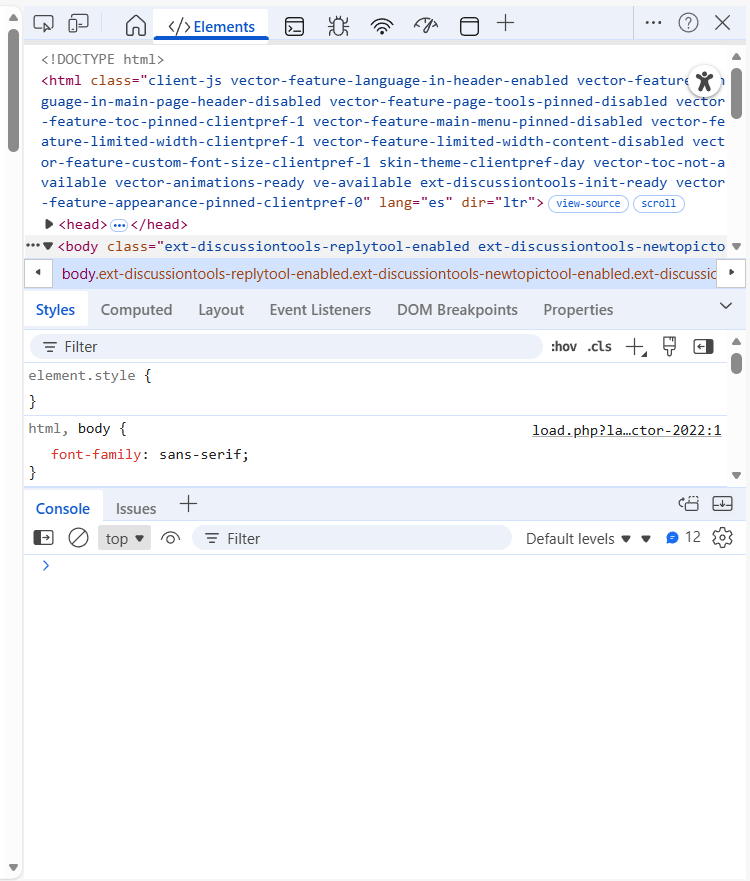

# UP08: XPath - Consulta de Información XML

## Índice

1. [Introducción](#1-introducción)
    1.1. [Contexto Histórico](#11-contexto-histórico)
    1.2. [El Cambio de Paradigma](#12-el-cambio-de-paradigma)
    1.3. [Tecnologías Relacionadas](#13-tecnologías-relacionadas)
    1.4. [Alcance de Esta Unidad](#14-alcance-de-esta-unidad)
2. [XPath: Lenguaje de Consulta](#2-xpath-lenguaje-de-consulta)
    2.1. [Fundamentos](#21-fundamentos)
    2.2. [Sintaxis Básica de XPath](#22-sintaxis-básica-de-xpath)
    2.3. [Predicados (Filtros)](#23-predicados-filtros)
    2.4. [Ejes de Navegación (Axes)](#24-ejes-de-navegación-axes)
    2.5. [Funciones de XPath 1.0](#25-funciones-de-xpath-10)
    2.6. [Casos de Uso Reales de XPath](#26-casos-de-uso-reales-de-xpath)
    2.7. [Dónde XPath 1.0 no llega](#27-dónde-xpath-10-no-llega)
3. [Herramientas y Recursos](#3-herramientas-y-recursos)
    3.1. [Herramientas Online](#31-herramientas-online)
    3.2. [Herramientas de Escritorio](#32-herramientas-de-escritorio)
    3.3. [Depuración en Navegadores](#33-depuración-en-navegadores)
    3.4. [Extensiones de Visual Studio Code](#34-extensiones-de-visual-studio-code)
    3.5. [Documentación Oficial](#35-documentación-oficial)
4. [Evaluación](#4-evaluación)
    4.1. [Contenido Evaluable](#41-contenido-evaluable)

---

## 1. Introducción

### 1.1. Contexto Histórico

A finales de los años 90, con el auge de **XML** como estándar universal para el intercambio y almacenamiento de datos estructurados, surgió una necesidad crítica: poder **consultar** y **transformar** estos documentos de manera eficiente sin tener que escribir programas complejos para cada caso.

Antes de la aparición de estas tecnologías, para extraer información de un documento XML, los programadores debían usar el **DOM** (Document Object Model) o **SAX** (Simple API for XML), que requerían escribir mucho código imperativo explicando paso a paso *"cómo"* recorrer el árbol de nodos. Esto era tedioso, propenso a errores y poco reutilizable.

En **1999**, el **W3C** (World Wide Web Consortium) publicó dos especificaciones que revolucionaron el trabajo con XML:

- **XPath** (XML Path Language): Un lenguaje declarativo para navegar y seleccionar nodos en documentos XML
- **XSLT** (eXtensible Stylesheet Language Transformations): Un lenguaje para transformar documentos XML en otros formatos

### 1.2. El Cambio de Paradigma

La potencia de estas tecnologías reside en el **cambio de paradigma**:

| Enfoque tradicional (DOM/SAX) | Enfoque moderno (XPath/XSLT) |
| ----------------------------- | ---------------------------- |
| **Imperativo**: Describes *"cómo"* obtener los datos paso a paso | **Declarativo**: Describes *"qué"* datos quieres |
| Código verboso y específico | Expresiones concisas y reutilizables |
| Difícil de mantener | Fácil de leer y modificar |

**Ejemplo comparativo:**

Para obtener todos los títulos de libros de una biblioteca:

**Con DOM (JavaScript):**

```javascript
let titulos = [];
let libros = doc.getElementsByTagName("libro");
for (let i = 0; i < libros.length; i++) {
    let titulo = libros[i].getElementsByTagName("titulo")[0];
    if (titulo) {
        titulos.push(titulo.textContent);
    }
}
```

**Con XPath:**

```xpath
//libro/titulo
```

### 1.3. Tecnologías Relacionadas

**XPath** y **XSLT** forman parte de un ecosistema más amplio:

- **XQuery**: Lenguaje de consulta avanzado para grandes conjuntos de datos XML, similar a SQL pero para XML
- **XPointer**: Extensión de XPath para crear enlaces a partes específicas de documentos XML
- **XLink**: Estándar para enlaces entre documentos XML
- **XPath 2.0/3.1**: Versiones modernas con tipado fuerte, expresiones regulares y funciones avanzadas

> **Nota importante:** En este curso nos centraremos en **XPath 1.0** (el más universal y compatible), que es la versión soportada nativamente por los navegadores web y la mayoría de herramientas.

### 1.4. Alcance de Esta Unidad

Esta unidad se centra exclusivamente en **XPath**, el lenguaje de consulta para documentos XML. XPath es la base fundamental que necesitas dominar para trabajar con datos XML.

**XSLT** (transformaciones) y **XSD** (esquemas avanzados) se cubren en el documento **UP08-ampliacion.md** como contenido **opcional y no evaluable**.

---

## 2. XPath: Lenguaje de Consulta

### 2.1. Fundamentos

#### 2.1.1. El Modelo de Datos

XPath **no trabaja directamente sobre el texto** del archivo XML. En su lugar, trabaja sobre una representación lógica en memoria llamada **Árbol de Nodos**.

**Proceso:**

1. Un **Parser** lee el archivo XML (serialización)
2. Construye en memoria el **Árbol de Nodos** (representación lógica)
3. XPath navega y consulta este árbol

**Ejemplo de transformación:**

```xml
<!-- Esto es lo que escribimos (serialización) -->
<biblioteca>
    <libro id="1">
        <titulo>Don Quijote</titulo>
    </libro>
</biblioteca>
```

**El árbol de nodos que ve XPath:**

```text
Document (/)
└── Element: biblioteca
    └── Element: libro
        ├── Attribute: id="1"
        └── Element: titulo
            └── Text: "Don Quijote"
```

Esta cuestión de trabajar contra el árbol permite que XPath pueda usarse también con documentos HTML en navegadores web. Aunque HTML no cumple estrictamente las reglas de XML, el parser HTML del navegador construye un DOM bien formado (aunque no sea XML), y ese DOM puede ser recorrido mediante XPath gracias a la API `document.evaluate`.

#### 2.1.2. Raíz del Documento vs. Elemento Raíz

**Una confusión muy común:** En XML, la **raíz del documento** (Document Node) y el **elemento raíz** (Root Element) son cosas diferentes aunque relacionadas.

| Concepto | Representación | Descripción |
| -------- | ------------- | ----------- |
| **Document Node** (Nodo Documento) | `/` | Raíz **absoluta e invisible** del árbol. Contenedor de todo el documento |
| **Root Element** (Elemento Raíz) | `/biblioteca` | Primer elemento visible. Hijo del Document Node |

**Analogía:**

- El **Document Node** es como el **lienzo** de un cuadro
- El **Root Element** es como la **pintura principal** en ese lienzo

A efectos prácticos, cuando usamos `/` en XPath, nos referimos al **Document Node**, y para acceder al elemento raíz usamos `/nombre-del-elemento`. Una diferencia clara es que el Document Node no tiene nombre ni atributos, mientras que el Root Element sí.

#### 2.1.3. Los 7 Tipos de Nodos

Todo en un documento XML se clasifica en uno de estos 7 tipos:

1. **Element Nodes** (Elementos): Las etiquetas (`<libro>`, `<titulo>`)
2. **Attribute Nodes** (Atributos): Pares clave-valor (`id="123"`)
3. **Text Nodes** (Texto): El contenido de los elementos
4. **Comment Nodes** (Comentarios): `<!-- comentario -->`
5. **Processing Instruction Nodes**: `<?xml-stylesheet ...?>`
6. **Namespace Nodes**: Declaraciones de espacios de nombres (`xmlns:ns="uri"`)
7. **Document Node**: La raíz del árbol (`/`)

**⚠️ Detalle importante:** Los **atributos NO son hijos** de los elementos. Están "asociados" a ellos, pero en una relación especial.

#### 2.1.4. String-Value: El Valor de un Nodo

Cada nodo tiene un **string-value** (valor de cadena):

- **Elemento**: Concatenación de **todo** el texto descendiente
- **Atributo**: Su valor
- **Texto**: Su contenido
- **Comentario**: El texto del comentario

**Ejemplo:**

```xml
<noticia>Hubo un <b>gran</b> evento</noticia>
```

El string-value de `<noticia>` es: `"Hubo un gran evento"` (XPath "aplana" la estructura)

#### 2.1.5. Normalización de Espacios en Blanco

A diferencia de HTML, en XML los espacios en blanco (espacios, tabulaciones, saltos de línea) **son significativos** y forman parte del valor de los nodos de texto.

**⚠️ Problema muy común:**

```xml
<autor>
    Cervantes
</autor>
```

El valor de este nodo **NO** es `"Cervantes"`, sino:

```text
"\n    Cervantes\n"
```

**Solución:** Usar la función `normalize-space()` que elimina espacios iniciales/finales y convierte múltiples espacios en uno solo.

```xpath
normalize-space(//autor) = "Cervantes"  ✓ Correcto
//autor = "Cervantes"                    ✗ Fallaría
```

---

### 2.2. Sintaxis Básica de XPath

Como primera aproximación os recomiendo visualizar el siguiente recurso [https://www.youtube.com/watch?v=0O1SyTh8Zxo](https://www.youtube.com/watch?v=0O1SyTh8Zxo) que explica de forma muy visual los conceptos básicos de XPath. A partir de aquí leer el contenido de este apartado y probar los ejemplos, es la mejor forma de aprender XPath.

#### 2.2.1. Rutas de Localización (Location Paths)

XPath usa una sintaxis similar a las **rutas de archivos** en sistemas operativos:

| Tipo de Ruta | Sintaxis | Ejemplo | Descripción |
| ------------ | -------- | -------- | ----------- |
| **Absoluta** | Comienza con `/` | `/biblioteca/libro` | Desde la raíz del documento |
| **Relativa** | No comienza con `/` | `libro/titulo` | Desde el nodo actual (contexto) |

Por nodo actual nos referimos al nodo donde se está evaluando la expresión XPath en ese momento.

#### 2.2.2. Expresiones Básicas

Vamos ahora a ver algunas expresiones básicas usando un ejemplo concreto. En este caso tenemos un documento XML que representa una biblioteca con varios libros.

Puedes probar los ejemplos en algunas de las webs que existen a tal efecto:

- [https://www.freeformatter.com/xpath-tester.html](https://www.freeformatter.com/xpath-tester.html)
- [https://xpather.com/](https://xpather.com/)

También es posible en navegadores web usando la consola de desarrollo (F12) y la función `document.evaluate`, o en VSCode con extensiones como "XML Tools".

Esto último lo tenéis explicado en Eniun en el siguiente enlace [https://www.eniun.com/tutorial-xpath/#12_Como_ejecuto_una_consulta_XPath](https://www.eniun.com/tutorial-xpath/#12_Como_ejecuto_una_consulta_XPath)

**Documento de ejemplo:**

```xml
<?xml version="1.0" encoding="UTF-8"?>
<biblioteca>
    <libro id="1" categoria="ficcion">
        <titulo>Don Quijote de la Mancha</titulo>
        <autor>Miguel de Cervantes</autor>
        <precio>25.50</precio>
    </libro>
    <libro id="2" categoria="poesia">
        <titulo>Veinte poemas de amor</titulo>
        <autor>Pablo Neruda</autor>
        <precio>18.00</precio>
    </libro>
    <libro id="3" categoria="ficcion">
        <titulo>Cien años de soledad</titulo>
        <autor>Gabriel García Márquez</autor>
        <precio>22.00</precio>
    </libro>
</biblioteca>
```

**Expresiones fundamentales:**

Para los siguientes ejemplos, asumimos que el contexto inicial es el **Document Node** (raíz del documento). Fíjate como en los primeros ejemplos navegamos desde la raíz absoluta `/`, por lo que debemos recorrer todo el camino.

```xpath
# Seleccionar todos los libros
/biblioteca/libro

# Seleccionar todos los títulos
/biblioteca/libro/titulo

# Resultado:
# <titulo>Don Quijote de la Mancha</titulo>
# <titulo>Veinte poemas de amor</titulo>
# <titulo>Cien años de soledad</titulo>

# Seleccionar todos los elementos de cualquier nivel llamados "titulo"
//titulo

# Seleccionar todos los elementos sin importar su nombre (todos)
//*

# Seleccionar el elemento raíz
/*

# Resultado: <biblioteca>...</biblioteca>
```

#### 2.2.3. Operador `//` (Descendientes)

En el anterior ejemplo has visto que también se podía seleccionar elementos directamente, sin necesidad de recorrer todo el árbol. Esto es gracias al operador `//` que selecciona **todos los descendientes** (hijos, nietos, bisnietos...):

```xpath
# Seleccionar TODOS los elementos "titulo" en cualquier nivel
//titulo

# Desde biblioteca, seleccionar todos los descendientes "autor"
/biblioteca//autor

# Equivale a: /biblioteca/libro/autor (en nuestro ejemplo)
```

**⚠️ Advertencia de rendimiento:** `//` es muy potente (y cómodo) pero costoso en documentos grandes. Úsalo cuando realmente necesites buscar en todos los niveles.

#### 2.2.4. Selección de Atributos

Los atributos se seleccionan con el símbolo `@`:

```xpath
# Seleccionar el atributo "id" de todos los libros
/biblioteca/libro/@id

# Resultado: 1, 2, 3

# Seleccionar todos los atributos "categoria"
/biblioteca/libro/@categoria

# Resultado: "ficcion", "poesia", "ficcion"

# Seleccionar TODOS los atributos de libros
/biblioteca/libro/@*
```

---

### 2.3. Predicados (Filtros)

Los **predicados** permiten filtrar nodos. Van entre corchetes `[]`.

#### 2.3.1. Predicados Posicionales

Con XPath es posible seleccionar nodos según su posición en el conjunto resultante. Además del acceso por índice existen funciones especiales como `last()` para el último nodo.

```xpath
# Primer libro
/biblioteca/libro[1]
# Resultado: <libro id="1">Don Quijote...</libro>

# Último libro
/biblioteca/libro[last()]
# Resultado: <libro id="3">Cien años de soledad...</libro>

# Primeros dos libros
/biblioteca/libro[position() <= 2]

# Libros en posiciones impares
/biblioteca/libro[position() mod 2 = 1]
```

**⚠️ Importante:** En XPath, las posiciones empiezan en **1**, no en 0 (como en muchos lenguajes de programación).

Algunas funciones útiles relacionadas con posiciones utilizadas en los ejemplos anteriores:

| Función | Descripción | Ejemplo |
| ------- | ----------- | ------- |
| `position()` | Posición del nodo actual | `/biblioteca/libro[position()=2]` |
| `last()` | Posición del último nodo | `/biblioteca/libro[last()]` |

#### 2.3.2. Predicados de Condición

Además de por posición, podemos filtrar nodos según condiciones sobre sus atributos o contenido. De nuevo, hay varias funciones útiles para esto.

```xpath
# Libros con atributo id igual a "2"
/biblioteca/libro[@id="2"]

# Libros de categoría "ficcion"
/biblioteca/libro[@categoria="ficcion"]
# Resultado: 2 libros (Don Quijote y Cien años de soledad)

# Libros con precio mayor a 20
/biblioteca/libro[precio > 20]
# Resultado: 2 libros

# Libros cuyo autor contiene "García"
/biblioteca/libro[contains(autor, "García")]
# Resultado: <libro id="3">...</libro>

# Libros cuyo título empieza con "Don"
/biblioteca/libro[starts-with(titulo, "Don")]
# Resultado: <libro id="1">...</libro>
```

Algunas funciones útiles para condiciones:

| Función | Descripción | Ejemplo |
| ------- | ----------- | ------- |
| `contains(s1, s2)` | ¿s1 contiene s2? | `contains(autor, "García")` |
| `starts-with(s1, s2)` | ¿s1 empieza con s2? | `starts-with(titulo, "Don")` |
| `string-length(s)` | Longitud de cadena | `string-length(titulo) > 10` |

#### 2.3.3. Predicados Complejos (Lógica Combinada)

También es posible combinar múltiples condiciones usando operadores lógicos como `and`, `or`, y `not`.

```xpath
# Libros de ficción con precio menor a 24
/biblioteca/libro[@categoria="ficcion" and precio < 24]
# Resultado: <libro id="3">Cien años de soledad</libro>

# Libros de ficción O poesía
/biblioteca/libro[@categoria="ficcion" or @categoria="poesia"]
# Resultado: Los 3 libros

# Libros que NO son de ficción
/biblioteca/libro[not(@categoria="ficcion")]
# Resultado: <libro id="2">Veinte poemas de amor</libro>

# Libros cuyo precio está entre 18 y 23
/biblioteca/libro[precio >= 18 and precio <= 23]
```

Los operadores lógicos en XPath son:

| Operador | Descripción | Ejemplo |
| -------- | ----------- | ------- |
| `and` | Y lógico | `cond1 and cond2` |
| `or` | O lógico | `cond1 or cond2` |
| `not()` | Negación | `not(cond)` |

#### 2.3.4. Predicados sobre Nodos Hijos

Los predicados también pueden basarse en la existencia o valor de nodos hijos, por ejemplo, podríamos seleccionar libros que tengan un autor específico o que contengan ciertos textos. Alguno de estos ejemplos ha aparecido anteriormente, por ejemplo para el precio, pero aquí los agrupamos para mayor claridad.

```xpath
# Libros que tienen un elemento autor
/biblioteca/libro[autor]

# Libros cuyo autor es "Pablo Neruda"
/biblioteca/libro[autor="Pablo Neruda"]

# Libros cuyo título contiene "amor" (case-sensitive)
/biblioteca/libro[contains(titulo, "amor")]
```

---

### 2.4. Ejes de Navegación (Axes)

Los **ejes** definen la dirección de navegación desde el nodo actual. La sintaxis completa es:

```text
eje::prueba-de-nodo[predicado]
```

Aunque normalmente usamos **sintaxis abreviada**.

#### 2.4.1. Ejes Principales (Forward Axes)

Los ejes principales permiten navegar hacia abajo o hacia adelante en el árbol.

| Eje | Abreviatura | Descripción | Ejemplo |
| ----- | ----------- | ------------- | --------- |
| `child::` | (ninguna) | Hijos directos | `child::libro` = `libro` |
| `descendant::` | no tiene abreviatura | Todos los descendientes | `descendant::titulo` |
| `descendant-or-self::` | `//` | Descendientes + nodo actual | `//titulo` |
| `attribute::` | `@` | Atributos | `attribute::id` = `@id` |
| `following-sibling::` | no tiene abreviatura | Hermanos siguientes | `following-sibling::libro` |
| `following::` | no tiene abreviatura | Todos los nodos siguientes | `following::*` |

**Ejemplo práctico:**

```xml
<biblioteca>
    <libro id="1">
        <titulo>Libro 1</titulo>
    </libro>
    <libro id="2">
        <titulo>Libro 2</titulo>
    </libro>
    <libro id="3">
        <titulo>Libro 3</titulo>
    </libro>
</biblioteca>
```

```xpath
# Desde el primer libro, obtener todos sus hermanos siguientes
/biblioteca/libro[1]/following-sibling::libro
# Resultado: libros 2 y 3

# Desde el primer título, obtener todos los siguientes títulos
/biblioteca/libro[1]/titulo/following::titulo
# Resultado: títulos de libros 2 y 3
```

#### 2.4.2. Ejes Inversos (Reverse Axes)

Por su parte, los ejes inversos permiten navegar hacia arriba o hacia atrás en el árbol.

| Eje | Abreviatura | Descripción | Ejemplo |
| ----- | ----------- | ------------- | --------- |
| `parent::` | `..` | Padre | `parent::libro` = `..` |
| `ancestor::` | no tiene abreviatura | Todos los ancestros | `ancestor::biblioteca` |
| `ancestor-or-self::` | no tiene abreviatura | Ancestros + nodo actual | `ancestor-or-self::*` |
| `preceding-sibling::` | no tiene abreviatura | Hermanos anteriores | `preceding-sibling::libro` |
| `preceding::` | no tiene abreviatura | Todos los nodos anteriores | `preceding::*` |

**Ejemplo práctico:**

```xpath
# Desde el tercer libro, obtener sus hermanos anteriores
/biblioteca/libro[3]/preceding-sibling::libro
# Resultado: libros 1 y 2

# Desde un título, subir a su elemento libro padre
//titulo[text()="Libro 2"]/parent::libro
# Resultado: <libro id="2">...</libro>

# Sintaxis abreviada:
//titulo[text()="Libro 2"]/..
```

#### 2.4.3. Eje Especial: Self

Por último, el eje `self` permite referirse al nodo actual.

| Eje | Abreviatura | Descripción | Ejemplo |
| ---- | ----------- | ----------- | ------- |
| `self::` | `.` | El nodo actual | `self::libro` = `.` |

```xpath
# Seleccionar el nodo actual si es un libro
./self::libro

# Útil en XSLT para referencias al nodo de contexto
.
```

---

### 2.5. Funciones de XPath 1.0

XPath incluye un conjunto de funciones integradas para manipular nodos, cadenas, números y booleanos. A continuación se describen las más comunes.

#### 2.5.1. Funciones de Nodos

Las funciones de nodos permiten contar, obtener nombres y posiciones.

| Función | Descripción | Ejemplo |
| ------- | ----------- | ------- |
| `count(nodeset)` | Cuenta nodos | `count(//libro)` → 3 |
| `name()` | Nombre del nodo | `name(/*)` → "biblioteca" |
| `local-name()` | Nombre sin prefijo | `local-name(//libro[1])` → "libro" |
| `position()` | Posición del nodo | `//libro[position()=2]` |
| `last()` | Posición del último | `//libro[last()]` |

**Ejemplos:**

```xpath
# Contar cuántos libros hay
count(/biblioteca/libro)
# Resultado: 3

# Contar libros de ficción
count(/biblioteca/libro[@categoria="ficcion"])
# Resultado: 2

# Obtener el nombre del elemento raíz
name(/*)
# Resultado: "biblioteca"
```

#### 2.5.2. Funciones de Cadena (String)

Las funciones de cadena permiten manipular texto.

| Función | Descripción | Ejemplo |
| ------- | ----------- | ------- |
| `string(obj)` | Convierte a cadena | `string(//precio[1])` → "25.50" |
| `concat(s1, s2, ...)` | Concatena cadenas | `concat("ID: ", @id)` |
| `contains(s1, s2)` | ¿s1 contiene s2? | `contains(titulo, "amor")` |
| `starts-with(s1, s2)` | ¿s1 empieza con s2? | `starts-with(titulo, "Don")` |
| `substring(s, pos, len)` | Subcadena | `substring(titulo, 1, 3)` |
| `string-length(s)` | Longitud | `string-length(titulo)` |
| `normalize-space(s)` | Elimina espacios extra | `normalize-space(autor)` |
| `translate(s, from, to)` | Reemplaza caracteres | `translate(titulo, "aeiou", "AEIOU")` |

**Ejemplos prácticos:**

```xpath
# Títulos que contienen "años"
//libro[contains(titulo, "años")]/titulo
# Resultado: <titulo>Cien años de soledad</titulo>

# Títulos de más de 20 caracteres
//libro[string-length(titulo) > 20]/titulo

# Concatenar autor y título
//libro/concat(autor, " - ", titulo)
# Resultado:
# "Miguel de Cervantes - Don Quijote de la Mancha"
# "Pablo Neruda - Veinte poemas de amor"
# ...

# Primeros 10 caracteres de cada título
//libro/substring(titulo, 1, 10)
```

#### 2.5.3. Funciones Numéricas

Las funciones numéricas permiten realizar cálculos y conversiones.

| Función | Descripción | Ejemplo |
| ------- | ----------- | ------- |
| `number(obj)` | Convierte a número | `number("25.50")` → 25.5 |
| `sum(nodeset)` | Suma valores | `sum(//precio)` |
| `round(num)` | Redondea | `round(3.7)` → 4 |
| `floor(num)` | Redondeo hacia abajo | `floor(3.7)` → 3 |
| `ceiling(num)` | Redondeo hacia arriba | `ceiling(3.2)` → 4 |

**Ejemplos:**

```xpath
# Suma de todos los precios
sum(//libro/precio)
# Resultado: 65.50

# Libros cuyo precio redondeado es 26
//libro[round(precio) = 26]

# Precio medio (requiere XPath 2.0 o división manual)
sum(//libro/precio) div count(//libro)
# Resultado: 21.833...
```

#### 2.5.4. Funciones Booleanas

Las funciones booleanas permiten trabajar con valores de verdad.

| Función | Descripción | Ejemplo |
| -------- | ----------- | ------- |
| `boolean(obj)` | Convierte a booleano | `boolean(//libro)` → true |
| `not(bool)` | Negación | `not(precio > 20)` |
| `true()` | Verdadero | `//libro[true()]` |
| `false()` | Falso | `//libro[false()]` |

**Reglas de conversión a booleano:**

- **true**: Nodo existe, número ≠ 0, cadena no vacía
- **false**: No hay nodos, número = 0, cadena vacía

```xpath
# Libros que NO tienen atributo categoria
//libro[not(@categoria)]

# Verificar si existe algún libro de precio > 30
boolean(//libro[precio > 30])
# Resultado: false
```

---

### 2.6. Casos de Uso Reales de XPath

#### 2.6.1. Web Scraping con XPath

XPath es fundamental para **extraer datos de HTML** en herramientas como Selenium, Scrapy, etc.

**Ejemplo HTML:**

```html
<div class="producto">
    <h2 class="titulo">Laptop HP</h2>
    <span class="precio">899€</span>
    <button>Comprar</button>
</div>
```

**Expresiones XPath para web scraping:**

```xpath
# Seleccionar todos los títulos de productos
//h2[@class="titulo"]

# Seleccionar todos los precios
//span[@class="precio"]

# Seleccionar el botón dentro de un producto
//div[@class="producto"]//button

# Productos cuyo título contiene "HP"
//div[@class="producto"][contains(.//h2, "HP")]
```

#### 2.6.2. Testing Automatizado (Selenium)

En **Selenium WebDriver**, XPath se usa para localizar elementos. Abajo un ejemplo sencillo en Python:

```python
# Python + Selenium
from selenium import webdriver
from selenium.webdriver.common.by import By

driver = webdriver.Chrome()
driver.get("https://ejemplo.com")

# Localizar por XPath
boton = driver.find_element(By.XPATH, "//button[text()='Iniciar sesión']")
boton.click()

# Seleccionar input por atributo placeholder
email_input = driver.find_element(By.XPATH, "//input[@placeholder='Email']")
```

#### 2.6.3. Validación y Pruebas de XML

Más allá de transformaciones y consultas, XPath es una **herramienta muy útil para validar** la integridad y calidad de documentos XML. Aunque los esquemas (XSD, DTD) validan la estructura, XPath permite hacer **validaciones semánticas** y de reglas de negocio que van más allá de la sintaxis.

**Contexto de uso:**

- **Control de calidad**: Verificar que los datos cumplen ciertas reglas antes de procesarlos
- **Pruebas automatizadas**: En entornos de testing, validar que el XML generado es correcto
- **Auditorías**: Buscar inconsistencias o datos problemáticos en grandes conjuntos de documentos
- **Depuración**: Identificar rápidamente elementos mal formados o con valores incorrectos

**Ejemplos de validaciones comunes:**

```xpath
# 1. Verificar que TODOS los libros tienen precio (integridad de datos)
count(//libro[not(precio)]) = 0
# Si el resultado es true, todos los libros tienen precio
# Si es false, hay libros sin precio

# 2. Verificar que NO HAY precios negativos (regla de negocio)
not(//precio[. < 0])
# true = todos los precios son válidos (>= 0)
# false = hay al menos un precio negativo

# 3. Encontrar libros sin autor para corregirlos
//libro[not(autor)]
# Devuelve los nodos de libros que no tienen elemento <autor>

# 4. Verificar que todos los atributos ID son únicos
count(//libro/@id) = count(distinct-values(//libro/@id))
# Nota: distinct-values es de XPath 2.0

# 5. Buscar precios que no tienen formato decimal válido
//libro[not(number(precio))]
# Encuentra libros cuyo precio no se puede convertir a número

# 6. Verificar que todos los ISBN tienen 13 caracteres
//libro[isbn and string-length(isbn) != 13]
# Devuelve libros con ISBN de longitud incorrecta
```

**Uso en scripts de validación:**

En entornos de producción, estas expresiones se pueden usar en scripts Python, Java o JavaScript para validar XMLs antes de procesarlos. A continuación un ejemplo sencillo en Python usando lxml:

```python
# Ejemplo en Python con lxml
from lxml import etree

# Cargar XML
doc = etree.parse('catalogo.xml')

# Validar que no hay libros sin precio
libros_sin_precio = doc.xpath('count(//libro[not(precio)])')
if libros_sin_precio > 0:
    print(f"Error: {libros_sin_precio} libros sin precio")
    # Mostrar cuáles son
    print(doc.xpath('//libro[not(precio)]/titulo/text()'))
else:
    print("Todos los libros tienen precio")
```

Nota: **lxml** es una biblioteca muy potente para trabajar con XML en Python, que soporta XPath 1.0.

Este tipo de validaciones son especialmente útiles cuando trabajas con datos externos o importados, donde no tienes control sobre la calidad del XML de origen.

---

### 2.7. Dónde XPath 1.0 no llega

Aunque XPath 1.0 es muy potente y cubre la mayoría de casos de uso, **tiene limitaciones importantes**. Es útil conocerlas para saber cuándo necesitarás herramientas más avanzadas.

**Limitaciones principales de XPath 1.0:**

| Limitación | Qué NO puedes hacer | Solución en versiones superiores |
| ---------- | ------------------- | -------------------------------- |
| **Sin expresiones regulares** | No puedes buscar patrones complejos como "emails válidos" o "códigos postales" | XPath 2.0: `matches()`, `replace()`, `tokenize()` |
| **Sin manejo de fechas** | No puedes comparar fechas o calcular diferencias | XPath 2.0: tipos `xs:date`, `xs:dateTime` |
| **Sin control de flujo** | No hay `if-then-else` ni bucles `for` | XPath 2.0: `if-then-else`, `for-return` (FLWOR) |
| **Tipado débil** | Todo es string, conversiones implícitas poco seguras | XPath 2.0: Sistema de tipos fuerte con esquemas |
| **Funciones limitadas** | No hay `max()`, `min()`, `distinct-values()` | XPath 2.0: biblioteca de funciones ampliada |
| **Sin agrupación** | No puedes agrupar elementos por criterios | XPath 2.0/XSLT 2.0: `group-by` |

**Ejemplos de lo que NO puedes hacer en XPath 1.0:**

Todos los siguientes ejemplos son imposibles de realizar con XPath 1.0 sin recurrir a trucos complejos o procesamiento adicional:

```xpath
# Buscar emails con expresiones regulares (IMPOSIBLE en 1.0)
//cliente[matches(email, '^[\w\.-]+@[\w\.-]+\.\w+$')]

# Obtener el máximo directamente (necesitas workarounds)
max(//libro/precio)

# Comparar fechas (se comparan como strings, puede dar errores)
//pedido[fecha > '2024-01-01']

# Condicional if-then-else
if (precio > 20) then "Caro" else "Barato"

# Eliminar duplicados de una lista
distinct-values(//libro/categoria)
```

**Workarounds en XPath 1.0:**

Algunas limitaciones se pueden sortear con trucos, pero son complejos:

```xpath
# Obtener el máximo precio (complejo y poco eficiente)
//libro[not(precio < //libro/precio)]/precio

# Simulación de if-then-else usando operadores booleanos (poco legible)
concat(
  substring('Barato', 1, 10 * (precio <= 20)),
  substring('Caro', 1, 5 * (precio > 20))
)
```

**¿Cuándo necesitas XPath 2.0 o superior?**

Considera usar **XPath 2.0/3.0** (con procesadores como Saxon) cuando:

- Trabajas con **grandes volúmenes de datos** que necesitan agrupación o filtrado complejo
- Necesitas **expresiones regulares** para validación o extracción de patrones
- Trabajas con **fechas, horas o tipos numéricos específicos** (decimales, enteros)
- Necesitas **operaciones de conjuntos** avanzadas (unión, intersección, diferencia)
- Trabajas en proyectos **XQuery** o **XSLT 2.0/3.0** (que requieren XPath 2.0+)

**Para este curso:**

Nos centraremos en **XPath 1.0** porque:

- Es el estándar universal soportado por navegadores
- Cubre el 90% de casos de uso prácticos
- Es más fácil de aprender y suficiente para la mayoría de proyectos
- Las herramientas más comunes (navegadores, Selenium, lxml) lo soportan

Si en el futuro necesitas funcionalidades avanzadas, ya tendrás una base sólida para migrar a XPath 2.0 o superior.

---

## 3. Herramientas y Recursos

Aunque al principio ya hemos visto algunas de estas herramientas, aquí tienes un resumen de las mejores opciones para practicar y aplicar XPath.

### 3.1. Herramientas Online

| Herramienta | URL | Descripción |
| ---------- | --- | ----------- |
| **XPather** | [https://xpather.com/](https://xpather.com/) | Probar expresiones XPath en tiempo real |
| **FreeFormatter** | [https://www.freeformatter.com/xpath-tester.html](https://www.freeformatter.com/xpath-tester.html) | Tester de XPath con ejemplos |
| **W3Schools XPath** | [https://www.w3schools.com/xml/xpath_intro.asp](https://www.w3schools.com/xml/xpath_intro.asp) | Tutorial interactivo de XPath |

### 3.2. Herramientas de Escritorio

**Editores XML:**

- **Visual Studio Code** (con extensiones XML Tools, XSLT/XPath)
- **Oxygen XML Editor** (profesional, de pago)
- **Notepad++** (con plugin XML Tools)

### 3.3. Depuración en Navegadores

También es posible realizar consultas XPath directamente en la consola de desarrollo de los navegadores, lo cual es muy útil para depurar y probar expresiones sobre documentos HTML.

Aunque XPath se diseñó para XML, también funciona perfectamente con **HTML** en los navegadores. Los navegadores modernos construyen un DOM (árbol de nodos) del HTML que XPath puede consultar.

**Chrome/Edge DevTools:**

Los navegadores incluyen funciones auxiliares para probar XPath directamente en la consola:

```javascript
$x("expresion-xpath")  // Devuelve array de nodos
```

**Ejemplo práctico con Wikipedia:**

1. Abre cualquier artículo de Wikipedia (por ejemplo: [https://es.wikipedia.org/wiki/Wikipedia:Portada](https://es.wikipedia.org/wiki/Wikipedia:Portada))
2. Pulsa **F12** para abrir DevTools
3. Ve a la pestaña **Console**
4. Prueba estas expresiones XPath:



```javascript
// Obtener el título principal de la página
$x("//h1[@id='firstHeading']")
// Resultado: [<h1 id="firstHeading">Wikipedia:Portada</h1>]

// Obtener el texto del título
$x("//h1[@id='firstHeading']")[0].textContent
// Resultado: "Wikipedia:Portada"
```

**Diferencia entre archivos XML y HTML:**

En archivos XML (.xml), el navegador muestra el árbol XML directamente
Puedes usar: `$x("//libro/titulo")`

En páginas HTML (.html), trabajas sobre el DOM renderizado
Puedes usar: `$x("//div[@class='content']/p")`

### 3.4. Extensiones de Visual Studio Code

- **XML Tools** (dotjoshjohnson.xml)
- **XSLT/XPath for Visual Studio Code** (deltaxml.xslt-xpath)
- **XML Language Support** (redhat.vscode-xml)

### 3.5. Documentación Oficial

- **XPath 1.0 Spec**: [https://www.w3.org/TR/xpath-10/](https://www.w3.org/TR/xpath-10/)
- **MDN Web Docs**: [https://developer.mozilla.org/es/docs/Web/XPath](https://developer.mozilla.org/es/docs/Web/XPath)
- **Eniun Tutorial XPath**: [https://www.eniun.com/tutorial-xpath/](https://www.eniun.com/tutorial-xpath/)

---

## 4. Evaluación

### 4.1. Contenido Evaluable

La evaluación de esta unidad incluirá:

**Contenido evaluable:**

- Todo el contenido de este documento (UP08.md)
- Los ejercicios de Aules

El siguiente contenido es **opcional** y **NO entra en el examen**:

- XSLT (transformaciones XML)
- XSD (esquemas avanzados)
- XPath 2.0/3.0 (expresiones regulares, tipos avanzados)
- Conceptos avanzados (namespaces, optimización)

Este contenido lo puedes consultar en **UP08-ampliacion.md** si te interesa profundizar.
