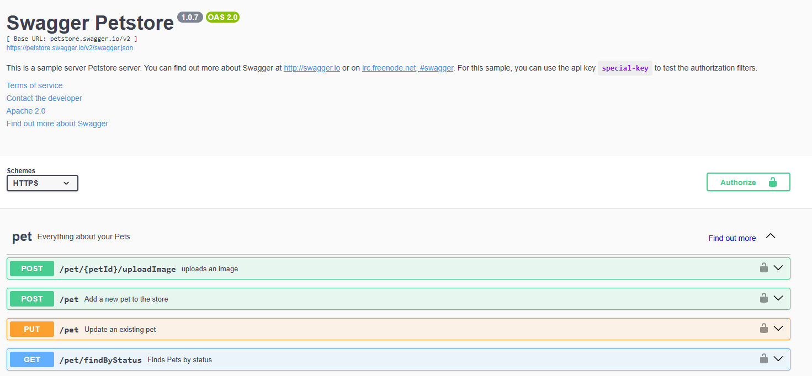
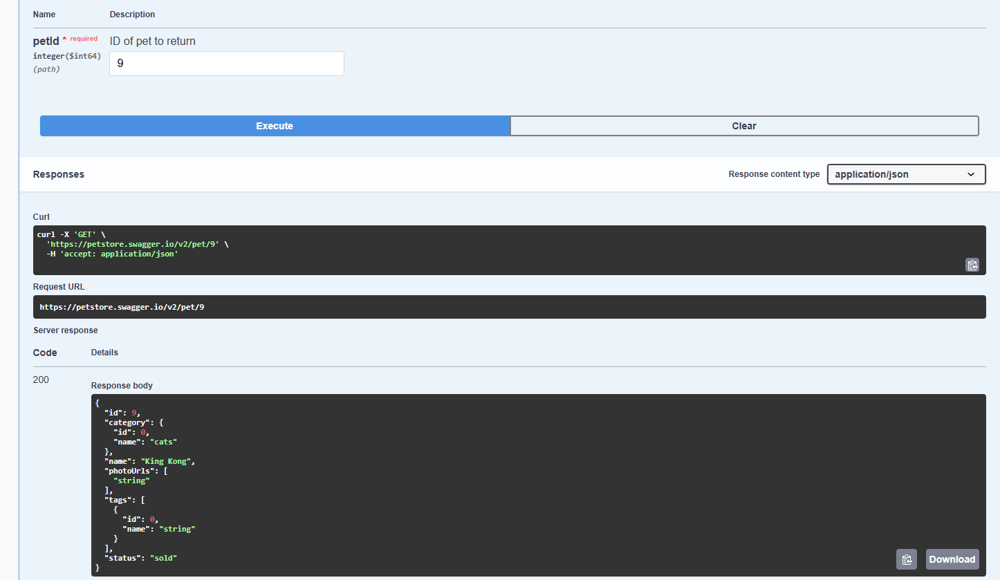
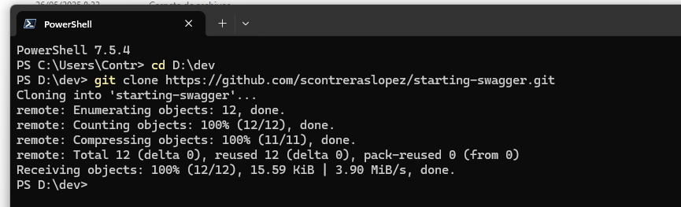
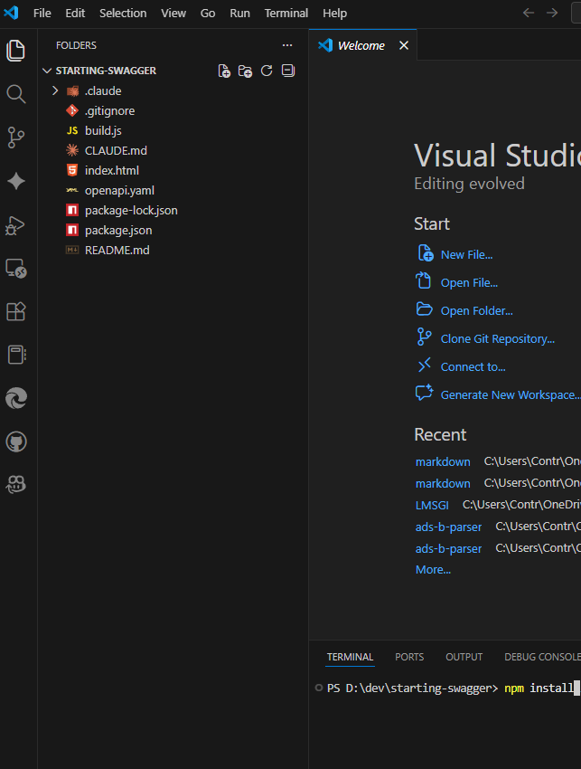
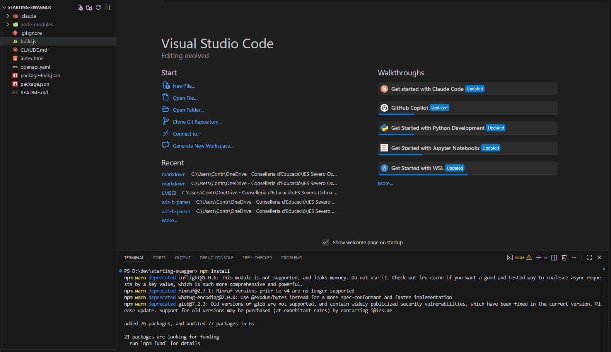
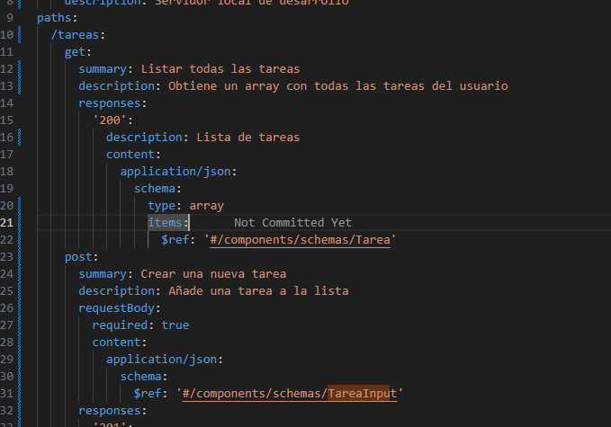
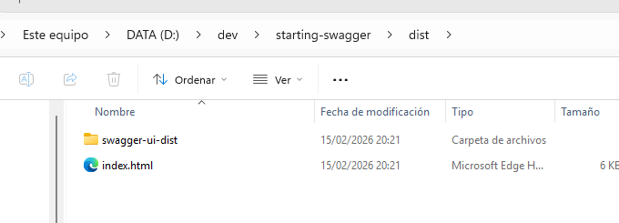
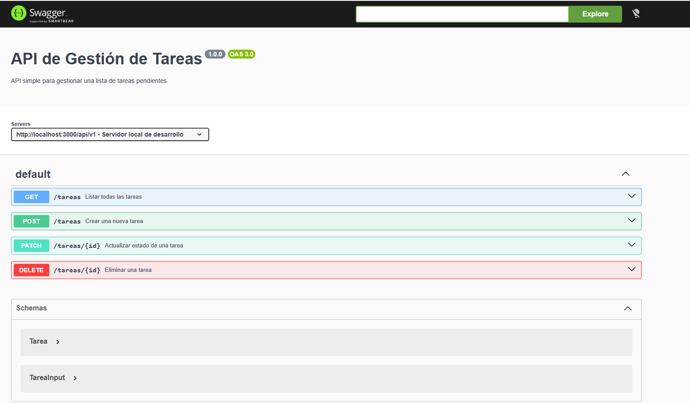
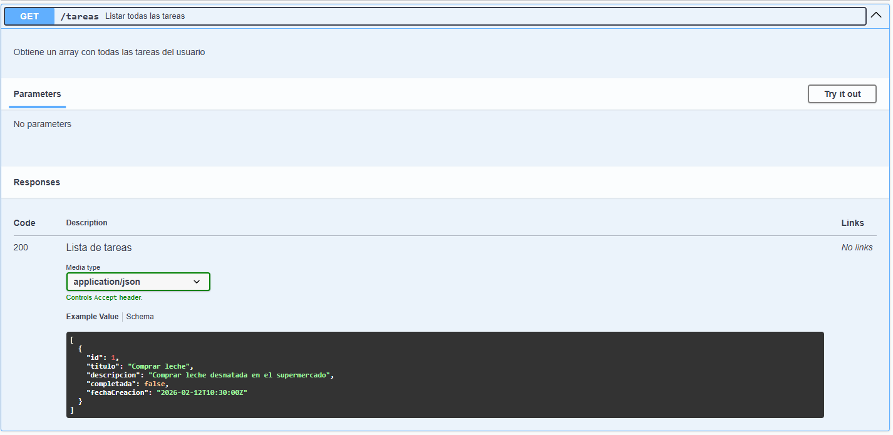

# UP09: Gestión de la Información - RSS, JSON, YAML y OpenAPI

## Índice

1. [Introducción](#1-introducción)
  1.1. [Contexto: Intercambio de Datos en la Web Moderna](#11-contexto-intercambio-de-datos-en-la-web-moderna)
  1.2. [Evolución: De Páginas Estáticas a APIs](#12-evolución-de-páginas-estáticas-a-apis)
  1.3. [Alcance de Esta Unidad](#13-alcance-de-esta-unidad)
2. [RSS - Sindicación de Contenidos](#2-rss---sindicación-de-contenidos)
  2.1. [¿Qué es RSS?](#21-qué-es-rss)
  2.2. [Estructura Básica de un Feed RSS](#22-estructura-básica-de-un-feed-rss)
  2.3. [Tutorial Completo](#23-tutorial-completo)
3. [JSON - Notación de Objetos JavaScript](#3-json---notación-de-objetos-javascript)
  3.1. [¿Qué es JSON?](#31-qué-es-json)
  3.2. [Sintaxis y Tipos de Datos](#32-sintaxis-y-tipos-de-datos)
  3.3. [JSON vs XML: Comparativa](#33-json-vs-xml-comparativa)
  3.4. [Validación JSON](#34-validación-json)
  3.5. [JSON en el Mundo Real](#35-json-en-el-mundo-real)
  3.6. [Conversión entre JSON y XML](#36-conversión-entre-json-y-xml)
  3.7. [YAML - Sintaxis Básica para OpenAPI](#37-yaml---sintaxis-básica-para-openapi)
4. [OpenAPI / Swagger - Documentación de APIs](#4-openapi--swagger---documentación-de-apis)
  4.1. [APIs REST: Conceptos Fundamentales](#41-apis-rest-conceptos-fundamentales)
  4.2. [De Swagger a OpenAPI](#42-de-swagger-a-openapi)
  4.3. [Estructura de un Documento OpenAPI 3.0](#43-estructura-de-un-documento-openapi-30)
  4.4. [Herramientas del Ecosistema](#44-herramientas-del-ecosistema)
  4.5. [Casos de Uso Reales](#45-casos-de-uso-reales)
  4.6. [Leer una Spec OpenAPI: Ejemplo Guiado](#46-leer-una-spec-openapi-ejemplo-guiado)
  4.7. [Crear tu Propia Spec: Ejemplo Guiado](#47-crear-tu-propia-spec-ejemplo-guiado)
5. [Resumen](#5-resumen)
6. [Evaluación](#6-evaluación)
  6.1. [Contenidos Evaluables](#61-contenidos-evaluables)
  6.2. [Contenidos NO Evaluables](#62-contenidos-no-evaluables)

---

## 1. Introducción

### 1.1. Contexto: Intercambio de Datos en la Web Moderna

En las unidades anteriores hemos trabajado con **XML**, un formato robusto y estructurado que dominó el intercambio de datos durante la década de 2000-2010. Sin embargo, la web ha evolucionado significativamente desde entonces.

Hoy en día, la mayoría de aplicaciones web y móviles necesitan:

- **Comunicarse entre cliente y servidor** de forma eficiente
- **Consumir datos de servicios externos** (APIs de terceros)
- **Distribuir contenido actualizado** a múltiples suscriptores
- **Documentar interfaces de programación** de forma clara y estandarizada

Para responder a estas necesidades, han surgido tecnologías complementarias a XML que priorizan la **simplicidad**, **velocidad** y **facilidad de uso**.

### 1.2. Evolución: De Páginas Estáticas a APIs

| Época | Paradigma | Tecnologías Clave |
| ----- | --------- | ----------------- |
| **1990-2000** | Web estática | HTML, CSS |
| **2000-2010** | Web dinámica + servicios SOAP | XML, XSLT, WSDL |
| **2010-actualidad** | APIs REST + Single Page Apps | JSON, RESTful APIs, OpenAPI |

**El cambio fundamental en el desarrollo web moderno** ha sido pasar de **aplicaciones basadas en renderizado completo en servidor** a **arquitecturas centradas en APIs** que devuelven datos, normalmente en formato **JSON**, para que el cliente (navegador o app) realice el renderizado. Este modelo ha impulsado la popularidad de **formatos ligeros como JSON** y la necesidad de **documentar APIs de forma estandarizada mediante OpenAPI**.

Aun así, en términos globales, la **mayor parte de la web sigue funcionando con renderizado server‑side tradicional**, especialmente en entornos **PHP** (WordPress, Drupal, Joomla), aunque el **consumo de APIs es cada vez más crítico** para las aplicaciones modernas.

### 1.3. Alcance de Esta Unidad

En esta unidad veremos cuatro tecnologías clave para la gestión moderna de información:

1. **RSS**: Sindicación de contenidos para blogs, podcasts y noticias
2. **JSON**: El formato de intercambio de datos más utilizado en la web actual
3. **YAML**: Formato de configuración altamente legible usado en OpenAPI y DevOps
4. **OpenAPI/Swagger**: Estándar para documentar APIs REST de forma profesional

>[!NOTE]
> Las transformaciones XSLT las tienes en UP08-ampliacion.md como contenido opcional no evaluable.

---

## 2. RSS - Sindicación de Contenidos

### 2.1. ¿Qué es RSS?

**RSS** (Really Simple Syndication o Rich Site Summary) es un formato basado en **XML** que permite distribuir contenido actualizado de forma automática. Los usuarios pueden suscribirse a un "feed" RSS y recibir notificaciones cuando hay contenido nuevo, sin tener que visitar la web manualmente.

**Casos de uso comunes:**

- Blogs y sitios de noticias
- Podcasts
- Actualizaciones de software
- Boletines y newsletters

### 2.2. Estructura Básica de un Feed RSS

Un documento RSS es un archivo XML con una estructura específica:

```xml
<?xml version="1.0" encoding="UTF-8"?>
<rss version="2.0">
  <channel>
    <title>Blog de Tecnología LMSGI</title>
    <link>https://ejemplo.com</link>
    <description>Artículos sobre desarrollo web y APIs</description>
    <language>es-ES</language>

    <item>
      <title>Introducción a OpenAPI</title>
      <link>https://ejemplo.com/openapi-intro</link>
      <description>Aprende a documentar tus APIs con OpenAPI 3.0</description>
      <pubDate>Wed, 12 Feb 2026 10:00:00 GMT</pubDate>
      <guid>https://ejemplo.com/openapi-intro</guid>
    </item>

    <item>
      <title>JSON vs XML: ¿Cuál elegir?</title>
      <link>https://ejemplo.com/json-vs-xml</link>
      <description>Comparativa entre los dos formatos de datos</description>
      <pubDate>Mon, 10 Feb 2026 08:30:00 GMT</pubDate>
      <guid>https://ejemplo.com/json-vs-xml</guid>
    </item>
  </channel>
</rss>
```

**Elementos principales:**

| Elemento | Descripción |
| -------- | ----------- |
| `<channel>` | Contenedor principal del feed |
| `<title>` | Título del canal o artículo |
| `<link>` | URL del sitio o artículo |
| `<description>` | Descripción breve del contenido |
| `<item>` | Cada entrada individual (artículo, episodio, etc.) |
| `<pubDate>` | Fecha de publicación en formato RFC 822 |
| `<guid>` | Identificador único del artículo |

### 2.3. Tutorial Completo

Para profundizar en RSS, consulta el tutorial completo de Eniun:

**[Tutorial RSS - Sindicación de Contenidos](https://www.eniun.com/tutorial-rss/)**

El tutorial cubre:

- Estructura detallada de feeds RSS 2.0
- Elementos opcionales (`category`, `enclosure`, `author`)
- Validación de feeds
- Lectores RSS populares
- Creación de feeds personalizados

---

## 3. JSON - Notación de Objetos JavaScript

### 3.1. ¿Qué es JSON?

**JSON** (JavaScript Object Notation) es un formato ligero de intercambio de datos, fácil de leer para humanos y fácil de parsear para máquinas. Aunque nació como parte de JavaScript, es completamente **independiente del lenguaje** y se utiliza en prácticamente todos los lenguajes de programación modernos.

**Ventajas principales:**

- **Simplicidad**: Sintaxis minimalista y clara
- **Ligereza**: Menos verboso que XML (menos bytes transferidos)
- **Compatibilidad nativa**: JavaScript puede parsear JSON sin librerías adicionales
- **Amplia adopción**: Estándar de facto en APIs REST

### 3.2. Sintaxis y Tipos de Datos

JSON soporta **6 tipos de datos**: 4 tipos primitivos y 2 tipos estructurados.

>[!NOTE]
> Pégale un vistazo a esta web [https://jsoncrack.com/editor](https://jsoncrack.com/editor) para experimentar con JSON de forma visual e interactiva. 100% recomendado para entender la estructura de datos JSON.

#### 3.2.1. Tipos Primitivos

```json
{
  "nombre": "María García",
  "edad": 28,
  "activo": true,
  "rol": null
}
```

| Tipo | Ejemplo | Notas |
| ---- | ------- | ----- |
| **String** | `"texto"` | Siempre entre comillas dobles |
| **Number** | `42`, `3.14`, `-10` | Enteros o decimales, sin comillas |
| **Boolean** | `true`, `false` | Minúsculas, sin comillas |
| **Null** | `null` | Representa ausencia de valor |

#### 3.2.2. Tipos Estructurados

**Array (lista ordenada):**

```json
{
  "lenguajes": ["JavaScript", "Python", "Java"],
  "numeros": [1, 2, 3, 4, 5]
}
```

**Object (conjunto de pares clave-valor):**

```json
{
  "direction": {
    "calle": "Gran Vía",
    "numero": 45,
    "ciudad": "Madrid",
    "codigoPostal": "28013"
  }
}
```

#### 3.2.3. Estructuras Anidadas

JSON permite anidar objetos y arrays indefinidamente:

```json
{
  "restaurante": {
    "nombre": "La Parrilla",
    "ubicacion": {
      "ciudad": "Valencia",
      "coordenadas": {
        "lat": 39.4699,
        "lng": -0.3763
      }
    },
    "platos": [
      {
        "id": 1,
        "nombre": "Paella Valenciana",
        "precio": 12.50,
        "alergenos": ["marisco", "pescado"],
        "disponible": true
      },
      {
        "id": 2,
        "nombre": "Arroz al horno",
        "precio": 10.00,
        "alergenos": [],
        "disponible": true
      }
    ],
    "valoraciones": [4.5, 4.8, 5.0, 4.2]
  }
}
```

En este ejemplo, tenemos un objeto `restaurante` que contiene otro objeto `ubicacion`, un array de objetos `platos` y un array de números `valoraciones`. `precio` es por ejemplo una propiedad de tipo `number` del objeto `plato`.

### 3.3. JSON vs XML: Comparativa

Veamos el **mismo dato** representado en ambos formatos:

**JSON:**

```json
{
  "libro": {
    "isbn": "978-84-1234-567-8",
    "titulo": "Introducción a las APIs REST",
    "autor": {
      "nombre": "Laura Martínez",
      "pais": "España"
    },
    "precio": 29.99,
    "disponible": true,
    "categorias": ["programación", "APIs", "web"]
  }
}
```

**XML:**

```xml
<libro isbn="978-84-1234-567-8">
  <titulo>Introducción a las APIs REST</titulo>
  <autor pais="España">
    <nombre>Laura Martínez</nombre>
  </autor>
  <precio>29.99</precio>
  <disponible>true</disponible>
  <categorias>
    <categoria>programación</categoria>
    <categoria>APIs</categoria>
    <categoria>web</categoria>
  </categorias>
</libro>
```

En este ejemplo vemos que ambas tecnologías sirven para representar la misma información, pero con sintaxis y estructura diferentes. Encuentra a continuación una tabla resumen de las diferencias entre JSON y XML:

| Aspecto | JSON | XML |
| ------- | ---- | --- |
| **Tamaño** | Más compacto (~30% menos caracteres) | Más verboso |
| **Legibilidad** | Muy clara y directa | Buena pero más "ruidosa" |
| **Arrays** | Soporte nativo `[]` | Requiere elementos repetidos |
| **Tipos de datos** | Tipos nativos (number, boolean) | Todo es texto |
| **Atributos** | No existen (todo son propiedades) | Soporta atributos en elementos |
| **Comentarios** | No permitidos | Permitidos |
| **Validación** | JSON Schema | DTD, XSD (más potentes) |
| **Uso principal** | APIs REST, configuración | Documentos complejos, SOAP |

### 3.4. Validación JSON

Aunque JSON no tiene comentarios ni DTD como XML, podemos validar su estructura usando:

#### 3.4.1. Validadores Online

- **[JSONLint](https://jsonlint.com/)**: Valida sintaxis y formatea JSON
- **[JSONFormatter](https://jsonformatter.org/)**: Validación y visualización en árbol

#### 3.4.2. JSON Schema

**JSON Schema** es a JSON lo que DTD/XSD es a XML: un formato para describir y validar la estructura de datos JSON. Es una herramienta poderosa para garantizar que los datos cumplen con un formato específico, especialmente útil en APIs REST para validar solicitudes y respuestas.

**Ejemplo de JSON Schema:**

```json
{
  "$schema": "http://json-schema.org/draft-07/schema#",
  "type": "object",
  "properties": {
    "nombre": {
      "type": "string",
      "minLength": 1
    },
    "edad": {
      "type": "integer",
      "minimum": 0,
      "maximum": 120
    },
    "email": {
      "type": "string",
      "format": "email"
    }
  },
  "required": ["nombre", "edad"]
}
```

> [!NOTE]
> JSON Schema standalone (fuera de OpenAPI) es contenido de ampliación no evaluable. Sin embargo, **sí es evaluable** el uso de JSON Schema dentro de OpenAPI para definir modelos de datos en `components/schemas`, ya que es fundamental para documentar APIs. Veremos esto en detalle en la sección de OpenAPI.

### 3.5. JSON en el Mundo Real

#### 3.5.1. APIs REST

El 99% de las APIs REST modernas devuelven datos en formato JSON:

```bash
GET https://api.ejemplo.com/usuarios/123
```

**Respuesta:**

```json
{
  "id": 123,
  "nombre": "Carlos Ruiz",
  "email": "carlos@ejemplo.com",
  "fechaRegistro": "2026-01-15T10:30:00Z"
}
```

#### 3.5.2. Archivos de Configuración

Muchas herramientas usan JSON para configuración:

**`package.json` (Node.js):**

```json
{
  "name": "mi-proyecto",
  "version": "1.0.0",
  "dependencies": {
    "express": "^4.18.0",
    "axios": "^1.6.0"
  }
}
```

**`tsconfig.json` (TypeScript):**

```json
{
  "compilerOptions": {
    "target": "ES6",
    "module": "commonjs",
    "strict": true
  }
}
```

#### 3.5.3. Almacenamiento de Datos

Bases de datos NoSQL como **MongoDB** almacenan documentos en formato similar a JSON (BSON). BSON, *binary JSON*, es una extensión binaria de JSON que permite tipos adicionales (como fechas y objetos binarios). Para más información, consulta [BSON en Wikipedia](https://en.wikipedia.org/wiki/BSON)

### 3.6. Conversión entre JSON y XML

Para profundizar en la conversión bidireccional entre JSON y XML, consulta:

**[Tutorial JSON - Conversión a XML y viceversa](https://www.eniun.com/tutorial-json/)**

### 3.7. YAML - Sintaxis Básica para OpenAPI

#### 3.7.1. ¿Qué es YAML?

**YAML** (YAML Ain't Markup Language) es un formato de serialización de datos diseñado para ser **extremadamente legible por humanos**. Se utiliza principalmente en archivos de configuración y especificaciones de APIs (como OpenAPI/Swagger).

**YAML nació con la intención de ser un superconjunto de JSON**, lo que implica que cualquier documento JSON válido es también un documento YAML válido. Esto facilita la interoperabilidad: si ya tienes datos en JSON, puedes integrarlos en YAML sin transformaciones complejas. Sin embargo, YAML ofrece una sintaxis más expresiva y menos ruidosa, especialmente útil cuando los documentos crecen en tamaño o complejidad. Algunas **ventajas diferencias clave de YAML sobre JSON** incluyen:

- **Legibilidad superior**: Sintaxis minimalista sin llaves ni comillas excesivas
- **Sensible a indentación**: Usa espacios (nunca tabs) para estructurar jerarquías
- **Comentarios nativos**: Soporta comentarios con `#`

El tema de que un documento JSON es también un documento YAML es importante para entender la relación entre ambos formatos. Esto significa que si tienes un archivo JSON, puedes renombrarlo a `.yaml` y seguirá siendo válido YAML. Sin embargo, la mayoría de los desarrolladores prefieren escribir directamente en YAML para aprovechar su legibilidad, especialmente en contextos como OpenAPI donde las especificaciones pueden ser extensas y complejas.

**¿Dónde se usa YAML?**

Cómo hemos comentado, YAML es el formato preferido para:

- Especificaciones OpenAPI (documentación de APIs)
- Docker Compose (`docker-compose.yml`)
- GitHub Actions (workflows CI/CD)
- Kubernetes (configuración de pods, servicios)
- Ansible (playbooks de automatización)

#### 3.7.2. Sintaxis Fundamental

##### Pares Clave-Valor

La estructura básica es `clave: valor` (notar el espacio después de los dos puntos):

```yaml
nombre: María García
edad: 28
activo: true
rol: null
```

**Equivalente en JSON:**

```json
{
  "nombre": "María García",
  "edad": 28,
  "activo": true,
  "rol": null
}
```

##### Objetos Anidados (Indentación)

La jerarquía se representa con **indentación de 2 espacios**:

```yaml
persona:
  nombre: Carlos Ruiz
  edad: 35
  direction:
    calle: Gran Vía
    numero: 45
    ciudad: Madrid
    codigoPostal: "28013"
```

**Equivalente en JSON:**

```json
{
  "persona": {
    "nombre": "Carlos Ruiz",
    "edad": 35,
    "direction": {
      "calle": "Gran Vía",
      "numero": 45,
      "ciudad": "Madrid",
      "codigoPostal": "28013"
    }
  }
}
```

> **Importante:** Los códigos postales que empiezan por 0 deben escribirse entre comillas (`"08001"`) para evitar que se interpreten como números octales. No ocurre en YAML 1.2, pero es una buena práctica para asegurar compatibilidad.

##### Listas (Arrays)

Las listas se definen con guiones `-`:

```yaml
lenguajes:
  - JavaScript
  - Python
  - Java
  - Ruby
```

**Equivalente en JSON:**

```json
{
  "lenguajes": ["JavaScript", "Python", "Java", "Ruby"]
}
```

**Sintaxis compacta (inline):**

Además de la sintaxis de guiones, YAML también permite definir listas en una sola línea usando corchetes:

```yaml
lenguajes: [JavaScript, Python, Java, Ruby]
```

##### Listas de Objetos

Combinación de guiones e indentación:

```yaml
usuarios:
  - id: 1
    nombre: Ana López
    email: ana@ejemplo.com
    activo: true
  - id: 2
    nombre: Pedro Martínez
    email: pedro@ejemplo.com
    activo: false
```

**Equivalente en JSON:**

```json
{
  "usuarios": [
    {
      "id": 1,
      "nombre": "Ana López",
      "email": "ana@ejemplo.com",
      "activo": true
    },
    {
      "id": 2,
      "nombre": "Pedro Martínez",
      "email": "pedro@ejemplo.com",
      "activo": false
    }
  ]
}
```

##### Comentarios

YAML soporta comentarios con `#` (JSON NO permite comentarios):

```yaml
# Configuración de la aplicación
servidor:
  puerto: 8080        # Puerto HTTP por defecto
  host: localhost
  debug: true         # Activar logs detallados en desarrollo
```

##### Strings Multilínea

**Literal (preserva saltos de línea) - `|`:**

```yaml
descripcion: |
  Este es un texto largo
  que ocupa varias líneas
  y mantiene los saltos de línea.
```

**Plegado (convierte saltos en espacios) - `>`:**

```yaml
resumen: >
  Este es un texto largo
  que ocupa varias líneas
  pero se une en una sola.
```

#### 3.7.3. Tipos de Datos

YAML soporta los mismos tipos básicos que JSON, pero con sintaxis más flexible:

| Tipo | Ejemplo YAML | Equivalente JSON |
| ---- | ------------ | ---------------- s|
| **String** | `nombre: Juan` | `"nombre": "Juan"` |
| **String con espacios** | `titulo: "El Quijote"` | `"titulo": "El Quijote"` |
| **Number (entero)** | `edad: 25` | `"edad": 25` |
| **Number (decimal)** | `precio: 19.99` | `"precio": 19.99` |
| **Boolean** | `activo: true` | `"activo": true` |
| **Null** | `rol: null` o `rol: ~` | `"rol": null` |
| **Array** | `tags: [web, api]` | `"tags": ["web", "api"]` |
| **Object** | `config: {debug: true}` | `"config": {"debug": true}` |

#### 3.7.4. YAML vs JSON: Comparativa

Veamos el **mismo dato** en ambos formatos:

**YAML:**

```yaml
libreria:
  nombre: Librería Central
  ubicacion:
    ciudad: Valencia
    coordenadas:
      lat: 39.4699
      lng: -0.3763
  libros:
    - isbn: "978-84-1234-567-8"
      titulo: Introducción a las APIs REST
      autor: Laura Martínez
      precio: 29.99
      disponible: true
      categorias:
        - programación
        - APIs
        - web
    - isbn: "978-84-9876-543-2"
      titulo: Diseño de Software
      autor: Roberto Sánchez
      precio: 34.50
      disponible: false
      categorias:
        - arquitectura
        - patrones
```

**JSON:**

```json
{
  "libreria": {
    "nombre": "Librería Central",
    "ubicacion": {
      "ciudad": "Valencia",
      "coordenadas": {
        "lat": 39.4699,
        "lng": -0.3763
      }
    },
    "libros": [
      {
        "isbn": "978-84-1234-567-8",
        "titulo": "Introducción a las APIs REST",
        "autor": "Laura Martínez",
        "precio": 29.99,
        "disponible": true,
        "categorias": ["programación", "APIs", "web"]
      },
      {
        "isbn": "978-84-9876-543-2",
        "titulo": "Diseño de Software",
        "autor": "Roberto Sánchez",
        "precio": 34.5,
        "disponible": false,
        "categorias": ["arquitectura", "patrones"]
      }
    ]
  }
}
```

| Aspecto | YAML | JSON |
| ------- | ---- | ---- |
| **Legibilidad** | Excelente (menos ruido visual) | Buena (llaves y comillas) |
| **Indentación** | Obligatoria (estructura el documento) | Opcional (solo estética) |
| **Comentarios** | Soportados con `#` | No permitidos |
| **Strings sin comillas** | Permitido en la mayoría de casos | Siempre entre comillas |
| **Uso principal** | Configuración, especificaciones | Intercambio de datos en APIs |
| **Curva de aprendizaje** | Media (indentación sensible) | Baja (sintaxis simple) |
| **Parsing** | Más lento | Más rápido (nativo en JS) |

#### 3.7.5. ¿Por Qué OpenAPI Usa YAML?

Aunque OpenAPI soporta tanto YAML como JSON, **YAML es el formato preferido** por:

1. **Legibilidad**: Las especificaciones OpenAPI son largas y complejas. YAML las hace más fáciles de leer y mantener.
2. **Comentarios**: Permite documentar decisiones de diseño directamente en la spec.
3. **Menos ruido visual**: Sin llaves ni comillas excesivas, es más fácil enfocarse en el contenido.
4. **Estándar de la industria**: La mayoría de documentación y ejemplos usan YAML.

**Comparación del mismo endpoint en YAML vs JSON:**

**YAML (OpenAPI preferido):**

```yaml
paths:
  /usuarios/{id}:
    get:
      summary: Obtener usuario por ID
      parameters:
        - name: id
          in: path
          required: true
          schema:
            type: integer
      responses:
        '200':
          description: Usuario encontrado
          content:
            application/json:
              schema:
                $ref: '#/components/schemas/Usuario'
        '404':
          description: Usuario no encontrado
```

**JSON (válido pero menos legible):**

```json
{
  "paths": {
    "/usuarios/{id}": {
      "get": {
        "summary": "Obtener usuario por ID",
        "parameters": [
          {
            "name": "id",
            "in": "path",
            "required": true,
            "schema": {
              "type": "integer"
            }
          }
        ],
        "responses": {
          "200": {
            "description": "Usuario encontrado",
            "content": {
              "application/json": {
                "schema": {
                  "$ref": "#/components/schemas/Usuario"
                }
              }
            }
          },
          "404": {
            "description": "Usuario no encontrado"
          }
        }
      }
    }
  }
}
```

#### 3.7.6. Validación y Herramientas

**Validadores Online:**

- **[YAML Lint](http://www.yamllint.com/)**: Valida sintaxis YAML
- **[YAML to JSON](https://www.json2yaml.com/)**: Conversión bidireccional

**Errores Comunes en YAML:**

1. **Mezclar tabs y espacios**: Igual que en python, mezclar esto es un pecado capital en YAML. Siempre usa espacios (2 por nivel de indentación).
2. **Olvidar el espacio después de `:`**:

   ```yaml
   # Incorrecto
   nombre:María

   # Correcto
   nombre: María
   ```

3. **Indentación inconsistente**: Asegúrate de usar la misma cantidad de espacios para cada nivel de indentación.

4. **Strings que parecen números/booleanos**: Hay que tener en cuenta si queremos devolver una string "yes" o un booleano, que en YAML se interpreta como `true`:

   ```yaml
   # Esto se interpreta como booleano true
   respuesta: yes

   # Para forzar a string, usar comillas
   respuesta: "yes"
   ```

#### 3.7.7. Resumen: ¿Cuándo Usar YAML?

**Usa YAML para:**

- Archivos de configuración (legibilidad + comentarios)
- Especificaciones OpenAPI/Swagger
- Archivos CI/CD (GitHub Actions, GitLab CI)
- Infraestructura como código (Docker Compose, Kubernetes)

**Usa JSON para:**

- Intercambio de datos en APIs REST (velocidad de parsing)
- Configuración simple sin necesidad de comentarios
- Cuando JavaScript procesará los datos directamente

> **Nota importante:** En el resto de esta unidad, todos los ejemplos de OpenAPI usarán YAML. Asegúrate de entender la sintaxis básica de esta sección antes de continuar.

---

## 4. OpenAPI / Swagger - Documentación de APIs

### 4.1. APIs REST: Conceptos Fundamentales

Antes de hablar de OpenAPI, necesitamos entender qué es una **API REST**.

#### 4.1.1. ¿Qué es una API?

**API** (Application Programming Interface) es un contrato que define cómo dos sistemas se comunican entre sí. En el contexto web, una API permite que aplicaciones cliente soliciten datos o acciones a un servidor mediante HTTP.

#### 4.1.2. ¿Qué es REST?

**REST** (Representational State Transfer) es un estilo arquitectónico para diseñar APIs que usa:

- **Recursos identificados por URLs**: `/usuarios`, `/productos/42`
- **Métodos HTTP estándar**: GET, POST, PUT, DELETE, PATCH
- **Respuestas en formato estándar**: JSON (principalmente)
- **Sin estado (stateless)**: Cada petición es independiente

#### 4.1.3. Métodos HTTP (Verbos)

Nota: Idempotencia significa que hacer la misma petición varias veces tiene el mismo efecto que hacerla una sola vez.

| Método | Propósito | Ejemplo | Idempotente* |
| ------ | --------- | ------- | ------------ |
| **GET** | Leer/obtener datos | `GET /productos/42` | Yes |
| **POST** | Crear nuevo recurso | `POST /productos` | No |
| **PUT** | Actualizar (reemplazar) recurso completo | `PUT /productos/42` | Yes |
| **PATCH** | Actualizar parcialmente | `PATCH /productos/42` | No |
| **DELETE** | Eliminar recurso | `DELETE /productos/42` | Yes |

> ***Idempotente:** Hacer la misma petición múltiples veces produce el mismo resultado que hacerla una sola vez.

#### 4.1.4. Códigos de Respuesta HTTP

| Código | Significado | Uso típico |
| ------ | ----------- | ---------- |
| **200** | OK | Petición exitosa (GET, PUT, PATCH) |
| **201** | Created | Recurso creado exitosamente (POST) |
| **204** | No Content | Operación exitosa sin contenido (DELETE) |
| **400** | Bad Request | Datos de entrada inválidos |
| **401** | Unauthorized | Autenticación requerida o fallida |
| **403** | Forbidden | Sin permisos para acceder |
| **404** | Not Found | Recurso no encontrado |
| **500** | Internal Server Error | Error en el servidor |

### 4.2. De Swagger a OpenAPI

Swagger fue la primera herramienta popular para documentar APIs REST, pero con el tiempo evolucionó y se estandarizó bajo el nombre de OpenAPI Specification (OAS). Muchas personas (entre las que me incluyo) siguen usando "Swagger" como sinónimo de OpenAPI, pero es importante entender la diferencia.

#### 4.2.1. Historia

Una breve cronología de la evolución de Swagger a OpenAPI:

- **2011**: Tony Tam crea **Swagger** en Wordnik como herramienta para documentar APIs REST
- **2015**: Swagger donado a la **OpenAPI Initiative** (Linux Foundation)
- **2016**: Swagger pasa a llamarse oficialmente **OpenAPI Specification (OAS)**
- **2017**: Lanzamiento de **OpenAPI 3.0** (versión moderna)

#### 4.2.2. Terminología Actual

¿Pero no habías dicho que Swagger es la nomenclatura antigua? Sí, pero el ecosistema de herramientas sigue usando el nombre "Swagger" para referirse a sus productos. Por eso es común que se hable de "Swagger UI" o "Swagger Editor" aunque la especificación se llame OpenAPI.

| Término | Significado |
| ------- | ----------- |
| **OpenAPI** | La especificación estándar para documentar APIs (archivo `.yaml` o `.json`) |
| **Swagger UI** | Herramienta para visualizar specs OpenAPI en el navegador |
| **Swagger Editor** | Editor online para escribir y validar specs OpenAPI |
| **Swagger Codegen** | Generador de código cliente/servidor desde specs |

> **En resumen:** "OpenAPI" es la especificación, "Swagger" son las herramientas del ecosistema. Aunque a menudo se usan indistintamente, es importante entender esta distinción para evitar confusiones.

### 4.3. Estructura de un Documento OpenAPI 3.0

Una especificación OpenAPI es un archivo YAML (o JSON) que describe toda la API de forma declarativa.

#### 4.3.1. Ejemplo Básico Completo

Este ejemplo muestra una **API de librería online** completamente documentada en OpenAPI 3.0. La API permite gestionar un catálogo de libros con operaciones de lectura, creación y eliminación.

**Explicación por secciones:**

**Metadatos iniciales:**
La especificación comienza identificándose como OpenAPI 3.0.3 y proporciona información sobre la API: título "API de Librería Online", descripción de su propósito y versión 1.0.0.

**Servidores:**
Define dos entornos donde la API está disponible: un servidor de producción en `https://api.libreria.com/v1` y otro de staging para pruebas. Esta separación permite que los consumidores de la API elijan el servidor apropiado según sus necesidades.

**Endpoints principales:**

El endpoint `GET /libros` lista todos los libros disponibles. Sin parámetros adicionales, devuelve un array de objetos libro. La respuesta exitosa (código 200) contiene una lista estructurada según el esquema `Libro`. También contempla un posible error del servidor (500).

El endpoint `POST /libros` permite crear un nuevo libro. Requiere un cuerpo de solicitud en JSON con la estructura `LibroInput`, que contiene solo los datos esenciales para la creación. Si la operación es exitosa (201), devuelve el libro creado con su ID asignado automáticamente.

El endpoint `GET /libros/{libroId}` recupera los detalles de un libro específico. El parámetro `libroId` se extrae de la URL (path parameter) y es obligatorio. Puede devolver un 200 con los detalles del libro o un 404 si el libro no existe.

El endpoint `DELETE /libros/{libroId}` elimina un libro de la base de datos. Responde con 204 (sin contenido) si la eliminación es exitosa, o 404 si el libro ya no existe o nunca existió.

**Esquemas de datos:**

La sección `components/schemas` define la estructura de dos modelos reutilizables. El esquema `Libro` define un libro completo con todos sus campos: id (obligatorio), título, autor (obligatorios), ISBN con patrón de validación, precio (con validación de mínimo), y disponibilidad booleana.

El esquema `LibroInput` define qué datos envía el cliente al crear un nuevo libro. Es más simple que `Libro` porque no incluye el ID (asignado por el servidor) ni requiere campos de solo lectura. Solo son obligatorios título y autor, mientras que ISBN y precio son opcionales.

**Validaciones integradas:**

Observe cómo cada propiedad incluye validaciones: strings con longitud mínima, números con valores mínimos, booleanos para estados binarios, y patrones regex para formatos específicos como ISBN. Esto permite que el servidor valide automáticamente las solicitudes según la especificación.

```yaml
openapi: 3.0.3
info:
  title: API de Librería Online
  description: API para gestionar libros y autores
  version: 1.0.0

servers:
  - url: https://api.libreria.com/v1
    description: Servidor de producción
  - url: https://staging-api.libreria.com/v1
    description: Servidor de pruebas

paths:
  /libros:
    get:
      summary: Listar todos los libros
      description: Obtiene un array con todos los libros disponibles
      responses:
        '200':
          description: Lista de libros
          content:
            application/json:
              schema:
                type: array
                items:
                  $ref: '#/components/schemas/Libro'
        '500':
          description: Error del servidor

    post:
      summary: Crear un nuevo libro
      description: Añade un libro a la base de datos
      requestBody:
        required: true
        content:
          application/json:
            schema:
              $ref: '#/components/schemas/LibroInput'
      responses:
        '201':
          description: Libro creado exitosamente
          content:
            application/json:
              schema:
                $ref: '#/components/schemas/Libro'
        '400':
          description: Datos inválidos

  /libros/{libroId}:
    get:
      summary: Obtener un libro específico
      description: Recupera los detalles de un libro por su ID
      parameters:
        - name: libroId
          in: path
          required: true
          description: ID único del libro
          schema:
            type: integer
            example: 42
      responses:
        '200':
          description: Detalles del libro
          content:
            application/json:
              schema:
                $ref: '#/components/schemas/Libro'
        '404':
          description: Libro no encontrado

    delete:
      summary: Eliminar un libro
      description: Elimina un libro de la base de datos
      parameters:
        - name: libroId
          in: path
          required: true
          schema:
            type: integer
      responses:
        '204':
          description: Libro eliminado exitosamente
        '404':
          description: Libro no encontrado

components:
  schemas:
    Libro:
      type: object
      required:
        - id
        - titulo
        - autor
      properties:
        id:
          type: integer
          example: 42
        titulo:
          type: string
          example: "Clean Code"
        autor:
          type: string
          example: "Robert C. Martin"
        isbn:
          type: string
          pattern: '^978-\d{1,5}-\d{1,7}-\d{1,7}-\d$'
          example: "978-0-13-235088-4"
        precio:
          type: number
          format: float
          minimum: 0
          example: 34.99
        disponible:
          type: boolean
          example: true

    LibroInput:
      type: object
      required:
        - titulo
        - autor
      properties:
        titulo:
          type: string
        autor:
          type: string
        isbn:
          type: string
        precio:
          type: number
          minimum: 0
        disponible:
          type: boolean
          default: true
```

#### 4.3.2. Secciones Principales

**1. Metadata (`openapi`, `info`):**

```yaml
openapi: 3.0.3
info:
  title: Nombre de la API
  description: Descripción clara del propósito
  version: 1.0.0
  contact:
    email: soporte@ejemplo.com
  license:
    name: MIT
```

**2. Servidores (`servers`):**

```yaml
servers:
  - url: https://api.ejemplo.com/v1
    description: Producción
  - url: http://localhost:8080
    description: Desarrollo local
```

**3. Endpoints (`paths`):**

Cada ruta (endpoint) puede tener múltiples operaciones (GET, POST, etc.):

```yaml
paths:
  /usuarios:
    get:
      summary: Listar usuarios
      # ... respuestas
    post:
      summary: Crear usuario
      # ... requestBody, respuestas
```

**4. Modelos de datos (`components/schemas`):**

Define las estructuras de datos reutilizables:

```yaml
components:
  schemas:
    Usuario:
      type: object
      required:
        - email
        - nombre
      properties:
        id:
          type: integer
        email:
          type: string
          format: email
        nombre:
          type: string
          minLength: 2
          maxLength: 100
```

#### 4.3.3. Parámetros

Los parámetros pueden estar en diferentes ubicaciones:

```yaml
parameters:
  - name: userId      # Parámetro en la URL
    in: path
    required: true
    schema:
      type: integer

  - name: page        # Parámetro de query (?page=2)
    in: query
    schema:
      type: integer
      default: 1

  - name: X-API-Key   # Cabecera HTTP
    in: header
    required: true
    schema:
      type: string
```

**Ejemplo de uso:**

```text
GET /usuarios/42?page=2
Header: X-API-Key: abc123xyz
```

#### 4.3.4. Request Body

Para POST y PUT, definimos el cuerpo de la petición:

```yaml
requestBody:
  required: true
  description: Datos del nuevo producto
  content:
    application/json:
      schema:
        $ref: '#/components/schemas/ProductoInput'
      example:
        nombre: "Teclado Mecánico"
        precio: 89.99
        stock: 15
```

#### 4.3.5. Responses

Cada operación debe documentar sus posibles respuestas:

```yaml
responses:
  '200':
    description: Operación exitosa
    content:
      application/json:
        schema:
          $ref: '#/components/schemas/Producto'
  '404':
    description: Producto no encontrado
    content:
      application/json:
        schema:
          type: object
          properties:
            error:
              type: string
              example: "Producto con ID 999 no existe"
```

### 4.4. Herramientas del Ecosistema

#### 4.4.1. Swagger Editor

**URL:** [https://editor.swagger.io/](https://editor.swagger.io/)

Editor online que:

- Valida sintaxis YAML en tiempo real
- Muestra errores y advertencias
- Renderiza documentación automáticamente
- Permite exportar a JSON

**Cómo usarlo:**

1. Pega tu spec YAML en el panel izquierdo
2. Observa errores en rojo (si los hay)
3. Visualiza la documentación en el panel derecho

#### 4.4.2. Swagger UI

Interfaz web interactiva que renderiza tu spec OpenAPI como documentación navegable. Permite:

- Ver todos los endpoints organizados
- Leer descripciones y ejemplos
- **Probar requests directamente** ("Try it out")
- Ver respuestas de ejemplo

**Ejemplo visual:**

Cuando visitas la Swagger UI de una API, ves:

```text
GET /productos/{id}
   Obtener detalles de un producto

Parameters:
   id* (path) - integer - ID del producto

Responses:
   200 - Producto encontrado
   404 - Producto no encontrado

[Try it out] [Execute]
```

#### 4.4.3. Swagger Codegen

Genera código automáticamente desde una spec OpenAPI:

- **Cliente API** (JavaScript, Python, Java, etc.)
- **Servidor stub** (Node.js, Spring Boot, Flask, etc.)
- **Modelos de datos** (TypeScript interfaces, clases Java)

Esto acelera el desarrollo porque no tienes que escribir el código "boilerplate" manualmente.

#### 4.4.4. Ejemplo Interactivo: Swagger Petstore

**URL:** [https://petstore.swagger.io/](https://petstore.swagger.io/)

**Petstore** es el **ejemplo clásico y oficial** de OpenAPI/Swagger. Es una API de demostración completamente funcional que simula una tienda de mascotas.



**¿Por qué es importante conocerlo?**

1. **Es interactivo**: Puedes **ejecutar requests reales** directamente desde el navegador
2. **Spec completa**: Muestra todos los elementos de OpenAPI (schemas, parámetros, responses, etc.)
3. **Referencia universal**: Usado en tutoriales y documentación oficial
4. **Aprende explorando**: Puedes ver cómo están documentados endpoints complejos

**Qué puedes hacer en Petstore:**

```text
Ejemplos de endpoints disponibles:

POST /pet              → Añadir nueva mascota
GET  /pet/{petId}      → Buscar mascota por ID
PUT  /pet              → Actualizar mascota existente
DELETE /pet/{petId}    → Eliminar mascota

POST /store/order      → Hacer un pedido
GET  /store/inventory  → Consultar inventario

POST /user             → Crear usuario
GET  /user/login       → Login de usuario
```

**Cómo usarlo (pruébalo ahora):**

1. Abre [https://petstore.swagger.io/](https://petstore.swagger.io/)
2. Expande el endpoint **GET /pet/{petId}**
3. Click en **"Try it out"**
4. Introduce `petId: 9`
5. Click en **"Execute"**
6. Observa la **respuesta real** que devuelve la API



**Lo que verás:**

- **Request URL**: La URL exacta que se llamó
- **Response body**: El JSON devuelto (una mascota con sus datos)
- **Response headers**: Cabeceras HTTP
- **Response code**: 200 OK (o 404 si no existe)

**Ventajas vs. documentación en Word/PDF:**

| Aspecto | Word/PDF (estático) | Swagger UI (interactivo) |
| ------- | ------------------- | ------------------------ |
| **Actualización** | Manual, se desactualiza | Se genera automáticamente del código |
| **Probar API** | Hay que usar Postman/curl por separado | Botón "Try it out" integrado |
| **Ejemplos** | Texto copiado manualmente | Ejemplos reales ejecutables |
| **Navegación** | Buscar con Ctrl+F | Organizado por tags, filtrable |
| **Formato** | Inconsistente entre versiones | Estandarizado (OpenAPI spec) |
| **Mantenimiento** | Duplicado (código + doc) | Una sola fuente de verdad |

**Conclusión:** OpenAPI + Swagger UI hace la documentación **viva, interactiva y siempre actualizada**.

Como puedes observar, la expresividad de OpenAPI combinada con la interactividad de Swagger UI es una herramienta poderosa para mejorar la comunicación entre equipos y facilitar el consumo de APIs. Es una práctica estándar en la industria y un requisito común en muchos procesos de desarrollo.

#### 4.4.5. Generación Automática: Design-First vs Code-First

**Contexto importante:**

En esta unidad estás **diseñando manualmente** la spec OpenAPI (enfoque **design-first**). Pero en el mundo real, especialmente en proyectos en producción, muchos equipos usan frameworks que **generan automáticamente** la spec desde el código (enfoque **code-first**).

**Dos enfoques complementarios:**

##### Enfoque 1: Design-First (API-First)

**Lo que estás haciendo ahora:**

1. **Primero** diseñas la spec OpenAPI en YAML
2. **Después** implementas el código siguiendo la spec

**Ventajas:**

- Frontend y backend saben **exactamente** qué esperar antes de programar
- Equipos pueden trabajar **en paralelo** (frontend usa la spec como contrato)
- Mejor para **proyectos complejos** o equipos distribuidos
- Cambios en la API se **discuten y aprueban** antes de programar

**Desventajas:**

- Más trabajo inicial (escribir YAML manualmente)
- Riesgo de que código y spec **se desincronicen** si no hay disciplina

##### Enfoque 2: Code-First (Implementación primero)

**Cómo funciona:**

1. **Primero** programas la API en tu framework favorito
2. **El framework genera automáticamente** la spec OpenAPI desde tu código
3. **Swagger UI se genera automáticamente** en `/docs`

**Ventajas:**

- Más rápido al inicio (no escribes YAML)
- **Imposible** que código y documentación estén desincronizados
- Ideal para **prototipos rápidos** y equipos pequeños
- Documentación **siempre actualizada**

**Desventajas:**

- Menos control sobre el diseño de la API
- Frontend debe esperar a que backend implemente

**[AMPLIACIÓN] Frameworks principales que generan OpenAPI automáticamente:**

No vamos a entrar en detalles de cada uno, pero aquí tienes una tabla con los frameworks más populares que soportan generación automática de specs OpenAPI:

| Framework | Lenguaje | Librería | URL |
| --------- | -------- | -------- | --- |
| **FastAPI** | Python | Integrado | [fastapi.tiangolo.com](https://fastapi.tiangolo.com) |
| **Spring Boot** | Java | Springdoc OpenAPI | [springdoc.org](https://springdoc.org/) |
| **ASP.NET Core** | C# (.NET) | Swashbuckle | [github.com/domaindrivendev/Swashbuckle](https://github.com/domaindrivendev/Swashbuckle.AspNetCore) |
| **NestJS** | TypeScript/Node.js | @nestjs/swagger | [docs.nestjs.com](https://docs.nestjs.com/openapi/introduction) |
| **Flask** | Python | flask-smorest | [flask-smorest.readthedocs.io](https://flask-smorest.readthedocs.io/) |

Qué no te abrume si no entiendes estos ejemplos, son méramente ilustrativos para mostrar que la generación automática es una práctica común y que la mayoría de frameworks modernos la soportan de forma nativa o mediante plugins.

##### Ejemplo: FastAPI (Python)

```python
from fastapi import FastAPI
from pydantic import BaseModel

app = FastAPI()

class Reserva(BaseModel):
    sala_id: int
    fecha_inicio: str
    hora_inicio: str
    hora_fin: str
    num_asistentes: int

@app.post("/reservas", status_code=201)
def crear_reserva(reserva: Reserva):
    """Crea una nueva reserva de sala"""
    return {"id": 123, "estado": "pendiente", **reserva.dict()}

@app.get("/reservas/{reserva_id}")
def obtener_reserva(reserva_id: int):
    """Obtiene los detalles de una reserva"""
    return {"id": reserva_id, "sala_id": 5, "estado": "confirmada"}
```

**Lo que ocurre automáticamente:**

```text
Servidor corriendo en: http://localhost:8000

✅ Swagger UI interactiva:    http://localhost:8000/docs
✅ ReDoc (alternativa):        http://localhost:8000/redoc
✅ OpenAPI spec JSON:          http://localhost:8000/openapi.json
```

**Sin escribir una sola línea de YAML**, FastAPI genera:

- La spec OpenAPI 3.0 completa
- Swagger UI interactiva
- Validación automática de datos
- Documentación de schemas

##### Ejemplo: Spring Boot (Java)

```java
@RestController
@RequestMapping("/api/v1/reservas")
@Tag(name = "Reservas", description = "API de gestión de reservas")
public class ReservaController {

    @PostMapping
    @Operation(summary = "Crear nueva reserva")
    @ApiResponses({
        @ApiResponse(responseCode = "201", description = "Reserva creada"),
        @ApiResponse(responseCode = "400", description = "Datos inválidos")
    })
    public ResponseEntity<Reserva> crearReserva(@RequestBody ReservaInput reserva) {
        // Implementación
    }

    @GetMapping("/{id}")
    @Operation(summary = "Obtener reserva por ID")
    public Reserva obtenerReserva(@PathVariable Long id) {
        // Implementación
    }
}
```

**Con Springdoc OpenAPI** (dependencia Maven/Gradle):

```text
Swagger UI:  http://localhost:8080/swagger-ui.html
OpenAPI:     http://localhost:8080/v3/api-docs
```

**Ventaja común a todos:**

```text
CAMBIAS CÓDIGO → DOCUMENTACIÓN SE ACTUALIZA AUTOMÁTICAMENTE
```

Si añades un nuevo endpoint, modificas un schema, o cambias validaciones, la spec OpenAPI se regenera automáticamente al compilar/ejecutar.

##### ¿Cuál enfoque usar?

Como siempre, depende del contexto y las necesidades de tu proyecto, pero generalizando:

| Escenario | Enfoque recomendado |
| --------- | ----------------- |
| API pública (consumidores externos) | **Design-first** |
| Equipos grandes (frontend/backend separados) | **Design-first** |
| Prototipo rápido / MVP | **Code-first** |
| API interna (microservicios) | **Code-first** |
| Startup / equipo pequeño | **Code-first** |
| Mantenimiento de legacy | **Híbrido** |

**Muchos equipos usan un enfoque híbrido:** Este es en la práctica el mejor camino si las condiciones lo permiten, sino es fácil que durante el mantenimiento el código y la spec se desincronicen.

1. Diseñan la spec OpenAPI manualmente (design-first)
2. Implementan con un framework que genera specs (code-first)
3. **Comparan** ambas specs para validar que coinciden
4. Usan la spec generada en desarrollo (siempre actualizada)
5. Usan la spec manual como "contrato oficial" en producción

**[AMPLIACIÓN] Recursos para explorar:**

- **FastAPI Tutorial:** [https://fastapi.tiangolo.com/tutorial/](https://fastapi.tiangolo.com/tutorial/)
- **Springdoc OpenAPI:** [https://springdoc.org/](https://springdoc.org/)
- **Swashbuckle (.NET):** [https://github.com/domaindrivendev/Swashbuckle.AspNetCore](https://github.com/domaindrivendev/Swashbuckle.AspNetCore)
- **OpenAPI Generator:** [https://openapi-generator.tech/](https://openapi-generator.tech/) (genera código desde specs)

### 4.5. Casos de Uso Reales

Sección de ampliación para mostrar ejemplos concretos de cómo OpenAPI mejora la documentación, testing y validación en proyectos reales.

#### 4.5.1. Documentación de Equipos

**Escenario:** Empresa con frontend y backend separados

- **Antes de OpenAPI:** Documentación en Word/Google Docs, frecuentemente desactualizada
- **Con OpenAPI:**
  - Backend publica `api-spec.yaml`
  - Frontend sabe exactamente qué endpoints, parámetros y respuestas esperar
  - Swagger UI sirve de documentación interactiva
  - Cualquier cambio en la spec se detecta inmediatamente

#### 4.5.2. Testing Automatizado

Herramientas como **Dredd** o **Postman** pueden:

- Leer tu spec OpenAPI
- Generar tests automáticamente para cada endpoint
- Validar que la API real cumple con la especificación

#### 4.5.4. Validación de Contratos (Contract Testing)

En arquitecturas de microservicios:

- Cada servicio publica su spec OpenAPI
- Otros servicios consumen esas specs
- Tests automáticos validan que los contratos no se rompan

Esto evita que un cambio en un servicio rompa otros servicios sin previo aviso.

### 4.6. Leer una Spec OpenAPI: Ejemplo Guiado

Imagina que te dan esta spec y debes entender qué hace la API:

```yaml
openapi: 3.0.3
info:
  title: API de Reservas de Hotel
  version: 2.1.0

paths:
  /habitaciones/disponibles:
    get:
      summary: Buscar habitaciones disponibles
      parameters:
        - name: fechaEntrada
          in: query
          required: true
          schema:
            type: string
            format: date
            example: "2026-03-15"
        - name: fechaSalida
          in: query
          required: true
          schema:
            type: string
            format: date
        - name: huespedes
          in: query
          schema:
            type: integer
            minimum: 1
            maximum: 4
            default: 2
      responses:
        '200':
          description: Lista de habitaciones disponibles
          content:
            application/json:
              schema:
                type: array
                items:
                  $ref: '#/components/schemas/Habitacion'

  /reservas:
    post:
      summary: Crear una nueva reserva
      requestBody:
        required: true
        content:
          application/json:
            schema:
              $ref: '#/components/schemas/ReservaInput'
      responses:
        '201':
          description: Reserva creada
          content:
            application/json:
              schema:
                $ref: '#/components/schemas/Reserva'
        '400':
          description: Datos inválidos

components:
  schemas:
    Habitacion:
      type: object
      properties:
        numero:
          type: integer
        tipo:
          type: string
          enum: [individual, doble, suite]
        precioPorNoche:
          type: number
        caracteristicas:
          type: array
          items:
            type: string

    ReservaInput:
      type: object
      required:
        - habitacionNumero
        - fechaEntrada
        - fechaSalida
        - nombreHuesped
      properties:
        habitacionNumero:
          type: integer
        fechaEntrada:
          type: string
          format: date
        fechaSalida:
          type: string
          format: date
        nombreHuesped:
          type: string
        email:
          type: string
          format: email

    Reserva:
      allOf:
        - $ref: '#/components/schemas/ReservaInput'
        - type: object
          properties:
            id:
              type: integer
            estado:
              type: string
              enum: [confirmada, pendiente, cancelada]
            precioTotal:
              type: number
```

**Análisis paso a paso:**

1. **¿Qué hace esta API?**
   - Gestiona reservas de habitaciones de hotel

2. **¿Qué endpoints tiene?**
   - `GET /habitaciones/disponibles` - Buscar habitaciones
   - `POST /reservas` - Crear reserva

3. **¿Cómo busco habitaciones disponibles?**
   - Método: GET
   - Parámetros obligatorios: `fechaEntrada`, `fechaSalida` (query params)
   - Parámetro opcional: `huespedes` (por defecto 2, significa que si no lo especificas, se asume 2)
   - Validación: mínimo 1, máximo 4
   - Respuesta exitosa (200): Array de objetos `Habitacion`

4. **¿Cómo creo una reserva?**
   - Método: POST
   - Body (JSON): Objeto `ReservaInput` con habitación, fechas, nombre y email
   - Respuesta exitosa (201): Objeto `Reserva` con ID, estado y precio total

5. **¿Qué datos tiene una habitación?**
   - `numero` (integer)
   - `tipo` (solo puede ser "individual", "doble" o "suite")
   - `precioPorNoche` (number)
   - `caracteristicas` (array de strings)

### 4.7. Crear tu Propia Spec: Ejemplo Guiado

Vamos a crear paso a paso la spec para una **API de lista de tareas (TODO)**. Además lo vamos a hacer utilizando un proyecto plantilla [https://github.com/scontreraslopez/starting-swagger](https://github.com/scontreraslopez/starting-swagger) que ya tiene la estructura básica de un proyecto OpenAPI.

**Prerequisitos**:

- Tener instalado Node.js, sino no podrás instalar las dependencias ni ejecutar el proyecto. Lo puedes descargar desde [https://nodejs.org/](https://nodejs.org/).

- Clonar el repositorio de plantilla

```bash
git clone https://github.com/scontreraslopez/starting-swagger.git
```



Una vez clonado, lo abrís en tu editor de código favorito (VSCode, WebStorm, etc.) y verás que ya tiene una estructura básica de proyecto. Lo primero es instalar las dependencias. Para ello abrís la terminal integrada y ejecutáis:

```bash
npm install
```



Empezará a descargar y os aparecerá (en gris, ya que está a propósito metida en el .gitignore) una carpeta `node_modules` con todas las dependencias necesarias para ejecutar el proyecto.



En este punto ya estamos listos para empezar a escribir nuestra spec OpenAPI. El archivo principal donde vamos a trabajar es `openapi.yaml`. Lo abrimos y veremos que ya tiene una estructura básica que modificaremos.

**Requisitos:**

- Listar todas las tareas
- Crear nueva tarea
- Marcar tarea como completada
- Eliminar tarea

**Paso 1: Metadata básica:**

Lo primero es definir los metadatos de la API, como el título, descripción y versión. Esto es importante para que los consumidores de la API sepan de qué trata y qué versión están usando. Modifica esta sección en tu `openapi.yaml`:

```yaml
openapi: 3.0.3
info:
  title: API de Gestión de Tareas
  description: API simple para gestionar una lista de tareas pendientes
  version: 1.0.0

servers:
  - url: http://localhost:3000/api/v1
    description: Servidor local de desarrollo
```

El puerto del servidor es 3000, pero puedes cambiarlo si lo deseas. Si tuviésemos la API construida, sí sería importante que estuviese apuntando al socket correcto para que Swagger UI pueda hacer las peticiones reales.

**Paso 2: Definir el modelo de datos:**

Este es el *famoso* **json schema** que define cómo es una tarea. En este caso, cada tarea tiene un ID, un título, una descripción opcional, un estado de completada o no, y una fecha de creación. Para ello vamos a reemplazar la sección `components/schemas` con el siguiente contenido:

```yaml
components:
  schemas:
    Tarea:
      type: object
      required:
        - id
        - titulo
        - completada
      properties:
        id:
          type: integer
          example: 1
        titulo:
          type: string
          minLength: 1
          maxLength: 200
          example: "Comprar leche"
        descripcion:
          type: string
          example: "Comprar leche desnatada en el supermercado"
        completada:
          type: boolean
          example: false
        fechaCreacion:
          type: string
          format: date-time
          example: "2026-02-12T10:30:00Z"
```

Diseccionemos este modelo que acabamos de crear, estamos diciendo que el modelo `Tarea` es un objeto con las siguientes propiedades:

- `id`: un número entero que representa el identificador único de la tarea. Es obligatorio y tiene un ejemplo de valor. Los valores de ejemplo son útiles para que los consumidores de la API entiendan qué tipo de datos se espera.
- `titulo`: una cadena de texto que representa el título de la tarea. Es obligatorio, tiene una longitud mínima de 1 carácter y máxima de 200 caracteres, y también tiene un ejemplo.
- `descripcion`: una cadena de texto que representa una descripción opcional de la tarea. No es obligatorio, pero si se proporciona, puede ayudar a dar más contexto sobre la tarea.
- `completada`: un valor booleano que indica si la tarea está completada o no. Es obligatorio y tiene un ejemplo de `false`.
- `fechaCreacion`: una cadena de texto con formato de fecha y hora que indica cuándo se creó la tarea. No es obligatorio, pero es útil para llevar un registro de cuándo se añadieron las tareas.

Con este modelo definido, podemos usarlo en nuestras respuestas para indicar que cuando el cliente solicite una tarea, recibirá un objeto con esta estructura. Ejemplo de un objeto `Tarea` válido:

```json
{
  "id": 1,
  "titulo": "Comprar leche",
  "descripcion": "Comprar leche desnatada en el supermercado",
  "completada": false,
  "fechaCreacion": "2026-02-12T10:30:00Z"
}
```

Otro ejemplo de una tarea sin descripción:

```json
{
  "id": 2,
  "titulo": "Llamar al médico",
  "completada": true,
  "fechaCreacion": "2026-02-10T15:00:00Z"
}
```

Ambos son ejemplos perfectamente válidos según el modelo que hemos definido, ya que la descripción es opcional. Eso sería el objeto que la aplicación va a devolver al cliente cuando este solicite una tarea.

También definimos un modelo de entrada para cuando el cliente quiera crear una nueva tarea. Este modelo es más simple porque no incluye el ID (que se asigna automáticamente) ni la fecha de creación (que también se asigna automáticamente). Solo requiere el título, que es lo mínimo necesario para crear una tarea.

```yaml
    TareaInput:
      type: object
      required:
        - titulo
      properties:
        titulo:
          type: string
          minLength: 1
          maxLength: 200
        descripcion:
          type: string
```

A la hora de escribir un json schema, es importante que lleves cuidado con la indentación, ya que es un formato sensible a los espacios. En este caso, cada nivel de indentación es de 2 espacios, y nunca debes usar tabs porque pueden causar errores de validación.

Ejemplos de objetos `TareaInput` válidos:

```json
{
  "titulo": "Comprar pan"
}
```

```json
{
  "titulo": "Hacer ejercicio",
  "descripcion": "Ir al gimnasio a las 7pm"
}
```

Recapitulemos como quedaría la sección de modelos de datos completa en nuestro `openapi.yaml`:

```yaml
components:
  schemas:
    Tarea:
      type: object
      required:
        - id
        - titulo
        - completada
      properties:
        id:
          type: integer
          example: 1
        titulo:
          type: string
          minLength: 1
          maxLength: 200
          example: "Comprar leche"
        descripcion:
          type: string
          example: "Comprar leche desnatada en el supermercado"
        completada:
          type: boolean
          example: false
        fechaCreacion:
          type: string
          format: date-time
          example: "2026-02-12T10:30:00Z"
    TareaInput:
      type: object
      required:
        - titulo
      properties:
        titulo:
          type: string
          minLength: 1
          maxLength: 200
        descripcion:
          type: string
```

Bien con esto ya tenemos definidos nuestros modelos de datos, ahora vamos a definir los endpoints de nuestra API para gestionar las tareas.

**Paso 3: Definir los endpoints:**

Vamos a definir los endpoints para listar tareas, crear una nueva tarea, actualizar el estado de una tarea y eliminar una tarea (típico CRUD). Para ello vamos a reemplazar la sección `paths` con el siguiente contenido:

```yaml
paths:
  /tareas:
    get:
      summary: Listar todas las tareas
      description: Obtiene un array con todas las tareas del usuario
      responses:
        '200':
          description: Lista de tareas
          content:
            application/json:
              schema:
                type: array
                items:
                  $ref: '#/components/schemas/Tarea'
```

Diseccionemos este endpoint `GET /tareas` que acabamos de crear:

- **Ruta**: `/tareas` - Esta es la URL a la que el cliente hará la petición para obtener la lista de tareas. ¿Qué significa esto? Que si el servidor está corriendo en `http://localhost:3000/api/v1`, el cliente hará una petición a `http://localhost:3000/api/v1/tareas` para obtener la lista de tareas. Si el servidor estuviera en producción, por ejemplo en `https://api.mis-tareas.com/v1`, entonces el cliente haría la petición a `https://api.mis-tareas.com/v1/tareas`.
- **Método HTTP**: `GET` - Esto indica que esta operación es para obtener datos. En este caso, el cliente está solicitando la lista de tareas, por lo que el método GET es el adecuado.
- **Summary**: "Listar todas las tareas" - Es una breve descripción de lo que hace este endpoint. Es importante que sea clara y concisa para que los consumidores de la API entiendan rápidamente su propósito.

Aquí entramos ahora en la sección de `responses`, que es crucial para documentar qué tipo de respuestas puede esperar el cliente al hacer una petición a este endpoint. Habría que documentar un bloque de respuestas para cada código HTTP relevante. En este caso, hemos documentado la respuesta para el código `200`, que indica que la operación fue exitosa y se devolvió la lista de tareas. En la sección de `content` indicamos que la respuesta será en formato `application/json` y que el cuerpo de la respuesta será un array de objetos `Tarea`, utilizando una referencia al modelo que definimos anteriormente.

Con esto ya tenemos documentada la operación para listar todas las tareas. Ahora vamos a documentar la operación para crear una nueva tarea.

```yaml
    post:
      summary: Crear una nueva tarea
      description: Añade una tarea a la lista
      requestBody:
        required: true
        content:
          application/json:
            schema:
              $ref: '#/components/schemas/TareaInput'
      responses:
        '201':
          description: Tarea creada exitosamente
          content:
            application/json:
              schema:
                $ref: '#/components/schemas/Tarea'
        '400':
          description: Datos inválidos (título vacío, etc.)
```

En este caso, el endpoint `POST /tareas` permite al cliente crear una nueva tarea. El cliente debe enviar un cuerpo de petición en formato JSON que siga el esquema `TareaInput`, que definimos anteriormente. Si la tarea se crea exitosamente, el servidor responderá con un código `201 Created` y devolverá el objeto `Tarea` recién creado, incluyendo su ID asignado y la fecha de creación. Si los datos enviados son inválidos (por ejemplo, si el título está vacío), el servidor responderá con un código `400 Bad Request` y una descripción del error. Asociado a la respuesta `400` podríamos también incluir un ejemplo de error para que los consumidores de la API sepan qué tipo de respuesta esperar en caso de error. Básicamente, si el cliente lo hace bien, recibirá un objeto `Tarea` con toda la información de la tarea creada. Si lo hace mal, recibirá un mensaje de error.

Fíjate que tanto el GET como el POST comparten la misma ruta `/tareas`, pero se diferencian por el método HTTP. Esto es completamente válido y común en APIs REST, ya que el método HTTP indica la acción que se va a realizar sobre el recurso identificado por la ruta.



Ahora vamos a por el endpoint para actualizar el estado de una tarea, que es un poco más complejo porque requiere un parámetro de ruta para identificar la tarea que queremos actualizar.

```yaml
  /tareas/{tareaId}:
    patch:
      summary: Actualizar estado de una tarea
      description: Marca una tarea como completada o pendiente
      parameters:
        - name: tareaId
          in: path
          required: true
          schema:
            type: integer
      requestBody:
        required: true
        content:
          application/json:
            schema:
              type: object
              properties:
                completada:
                  type: boolean
      responses:
        '200':
          description: Tarea actualizada
          content:
            application/json:
              schema:
                $ref: '#/components/schemas/Tarea'
        '404':
          description: Tarea no encontrada
```

Analicemos este endpoint `PATCH /tareas/{tareaId}`. Lo primero es que PATCH es el método HTTP adecuado para actualizaciones parciales, ya que solo queremos actualizar el campo `completada` de la tarea. Para actualizaciones completas (reemplazar toda la tarea) usaríamos PUT, pero en este caso solo queremos cambiar el estado de completada, por lo que PATCH es más apropiado. Veamos los elementos clave de este endpoint:

- **Ruta**: `/tareas/{tareaId}` - Aquí `{tareaId}` es un parámetro de ruta que representa el ID de la tarea que queremos actualizar. El cliente debe reemplazar `{tareaId}` con el ID real de la tarea que desea modificar. Por ejemplo, si queremos actualizar la tarea con ID 5, el cliente haría una petición a `/tareas/5`.
- **Parámetro de ruta**: En la sección de `parameters` definimos el parámetro de ruta `tareaId` con `required: true` y un esquema de tipo `integer`. Esto indica que el cliente debe proporcionar un ID de tarea válido en la URL para que la petición sea procesada correctamente.
- **Request body**: El cliente debe enviar un cuerpo de petición en formato JSON que contenga el campo `completada` con un valor booleano. Esto indica si la tarea debe marcarse como completada (`true`) o pendiente (`false`).
- **Respuestas**: Si la actualización es exitosa, el servidor responderá con un código `200 OK` y devolverá el objeto `Tarea` actualizado. Si no se encuentra una tarea con el ID proporcionado, el servidor responderá con un código `404 Not Found`.

Ejemplo de una petición válida para marcar la tarea con ID 5 como completada:

```text
PATCH /tareas/5
Content-Type: application/json
{
  "completada": true
}
```

Respuesta exitosa:

```json
{
  "id": 5,
  "titulo": "Llamar al médico",
  "descripcion": "Ir al hospital a las 3pm",
  "completada": true,
  "fechaCreacion": "2026-02-10T15:00:00Z"
}
```

Finalmente, vamos a documentar el endpoint para eliminar una tarea. Este endpoint es bastante sencillo, ya que solo requiere el ID de la tarea en la ruta y no necesita un cuerpo de petición. De nuevo delete comparte la misma ruta `/tareas/{tareaId}` pero con un método HTTP diferente.

```yaml
    delete:
      summary: Eliminar una tarea
      description: Elimina permanentemente una tarea de la lista
      parameters:
        - name: tareaId
          in: path
          required: true
          schema:
            type: integer
      responses:
        '204':
          description: Tarea eliminada exitosamente
        '404':
          description: Tarea no encontrada
```

Con esto tendríamos la spec lista, vamos ahora a exportarla. Para ello en la terminal integrada escribimos el siguiente comando:

```bash
npm run build
```

Tras unos instantes, nos avisará de que el build se ha completado exitosamente. En este momento si navegamos a la carpeta `dist` veremos que se ha generado un archivo `index.html` que es la documentación interactiva de nuestra API.



Si lo abres verás tu API documentada con Swagger UI, con todos los endpoints que acabamos de definir, y podrás probar cada uno de ellos haciendo clic en "Try it out". Recuerda que para que las pruebas funcionen, el servidor de tu API debe estar corriendo (cosa que no sucede todavía porque no existe dicha aplicación) y escuchando en el puerto que definiste en la sección de `servers` de tu spec.



En cualquier caso, además de detallar el schema, tienes las responses que hemos documentado como ejemplos de lo que la API devolvería en cada caso. Esto es muy útil para que los consumidores de la API sepan exactamente qué tipo de respuesta esperar, tanto en casos de éxito como en casos de error.



---

## 5. Resumen

En esta unidad hemos cubierto los pilares de la gestión moderna de información y RSS:

### RSS (Really Simple Syndication)

- Formato XML para distribuir contenido actualizado
- Estructura basada en `<channel>` e `<item>`
- Uso principal: blogs, podcasts, noticias
- Permite suscripción sin visitar la web manualmente

### JSON (JavaScript Object Notation)

- Formato ligero de intercambio de datos
- 6 tipos: string, number, boolean, null, array, object
- Más compacto y simple que XML
- Estándar de facto en APIs REST modernas
- Validación mediante JSON Schema (opcional)

### YAML (YAML Ain't Markup Language)

- Formato de serialización extremadamente legible
- Sensible a indentación (2 espacios, nunca tabs)
- Soporta comentarios con `#` (ventaja sobre JSON)
- Superconjunto de JSON (todo JSON válido es YAML válido)
- Uso principal: configuración, especificaciones OpenAPI, CI/CD
- Más legible que JSON para documentos complejos

### OpenAPI / Swagger

- Estándar para documentar APIs REST
- Archivo YAML/JSON con toda la especificación de la API
- Secciones principales: `info`, `servers`, `paths`, `components`
- Herramientas clave: Swagger Editor, Swagger UI, Codegen
- Casos de uso: documentación, generación de código, testing, validación de contratos

**Conceptos clave de APIs REST:**

- Métodos HTTP: GET (leer), POST (crear), PUT/PATCH (actualizar), DELETE (eliminar)
- Códigos de respuesta: 200 (OK), 201 (Created), 400 (Bad Request), 404 (Not Found)
- Recursos identificados por URLs
- Comunicación sin estado (stateless)

---

## 6. Evaluación

### 6.1. Contenidos Evaluables

Los siguientes contenidos son **obligatorios y evaluables**:

**RSS:**

- Estructura básica de un feed RSS 2.0
- Elementos `<channel>` e `<item>`
- Campos principales: `title`, `link`, `description`, `pubDate`, `guid`
- Casos de uso de RSS

**JSON:**

- Sintaxis y tipos de datos (string, number, boolean, null, array, object)
- Estructuras anidadas (objetos dentro de arrays, arrays dentro de objetos)
- Comparativa JSON vs XML (ventajas/desventajas)
- Uso de JSON en APIs REST
- Validación de sintaxis JSON

**YAML:**

- Sintaxis básica (pares clave-valor, indentación, listas)
- Tipos de datos y equivalencias con JSON
- Objetos anidados y listas de objetos
- Comentarios y strings multilínea
- Comparativa YAML vs JSON
- Por qué OpenAPI usa YAML
- Errores comunes (tabs vs espacios, indentación)

**OpenAPI / Swagger:**

- Conceptos de API REST (recursos, métodos HTTP, códigos de respuesta)
- Estructura de un documento OpenAPI 3.0
- Secciones principales: `info`, `servers`, `paths`, `components/schemas`
- Definición de endpoints (operaciones GET, POST, PUT, DELETE)
- Parámetros (path, query, header)
- Request body y responses
- Referencias `$ref` a componentes
- **Lectura e interpretación** de una spec OpenAPI existente
- **Creación** de una spec OpenAPI básica

**JSON Schema (en contexto de OpenAPI):**

- Definición de schemas en `components/schemas`
- Tipos de datos: `string`, `number`, `integer`, `boolean`, `array`, `object`
- Propiedades obligatorias: `required`
- Validaciones básicas:
  - Strings: `minLength`, `maxLength`, `pattern`, `format`, `enum`
  - Numbers: `minimum`, `maximum`
  - Arrays: `items` (para definir tipo de elementos)
- Propiedades de objeto: `properties`
- Ejemplos: `example`

### 6.2. Contenidos NO Evaluables

Los siguientes contenidos son **opcionales y no evaluables**. Ampliación:

- **XSLT** (transformaciones XML) - Ampliación de UP08
- **XSD** (esquemas XML avanzados) - Ampliación de UP08
- **JSON Schema avanzado** (fuera de OpenAPI):
  - Uso standalone de JSON Schema
  - Validaciones complejas: `allOf`, `anyOf`, `oneOf`, `not`
  - Schemas recursivos
  - Custom keywords
- **Swagger Codegen** (generación de código) - Ampliación conceptual
- **Enfoques Design-First vs Code-First** - Conceptual, no se exige implementar
- **Frameworks de generación automática** (FastAPI, Spring Boot, etc.) - Ampliación
