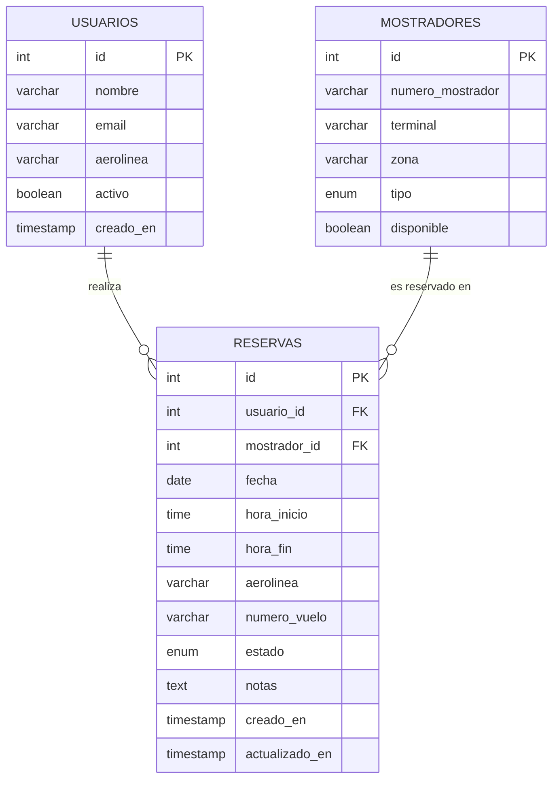

# Base de Datos Mínima - Sistema de Reservas de Mostradores AENA

> **Para estudiantes NO matriculados en Proyecto Intermodular**

Este documento describe un diseño de base de datos super básico que puedes usar para completar la actividad de diseño de API REST.

---

## Contexto del Sistema

**Escenario:** Sistema de reservas de mostradores de facturación en un aeropuerto gestionado por AENA.

**Usuarios:** Personal de las diferentes aerolíneas que necesitan reservar mostradores de facturación para procesar a sus pasajeros en franjas horarias específicas.

**Necesidad:** Las aerolíneas deben poder reservar mostradores de facturación para sus vuelos, especificando terminal, zona, fecha y horario.

---

## Introducción: ¿Qué es una Base de Datos? (Para quienes no cursaron BBDD)

> **No te asustes con lo que viene a continuación.** Si no has estudiado bases de datos, puede que veas términos raros (PRIMARY KEY, FOREIGN KEY, VARCHAR...). **No pasa nada.** No necesitas ser experto en bases de datos para hacer esta actividad. Solo necesitas entender **la idea general** de qué información se guarda y cómo se relaciona.

### ¿Qué es una base de datos en términos simples?

Imagina una base de datos como un **archivador digital** con varios cajones. Cada cajón contiene un tipo específico de información organizada en fichas.

**Analogía con el mundo real:**

```text
📁 ARCHIVADOR DEL AEROPUERTO
│
├── 📂 Cajón "USUARIOS"
│   ├── Ficha: María González (Iberia)
│   ├── Ficha: Carlos Ruiz (Ryanair)
│   └── Ficha: Ana Martín (Vueling)
│
├── 📂 Cajón "MOSTRADORES"
│   ├── Ficha: T1-A-05 (Internacional)
│   ├── Ficha: T1-B-08 (Nacional)
│   └── Ficha: T4-C-20 (Prioritario)
│
└── 📂 Cajón "RESERVAS"
    ├── Ficha: María reservó T1-A-05 el 15/03 de 8:00 a 10:30
    ├── Ficha: Carlos reservó T1-B-08 el 16/03 de 6:00 a 8:00
    └── Ficha: María reservó T2-A-12 el 20/03 de 14:00 a 16:00
```

En terminología de bases de datos:

- Cada **cajón** es una **TABLA**
- Cada **ficha** es un **REGISTRO** (o fila)
- Los **datos de cada ficha** (nombre, email, etc.) son **CAMPOS** (o columnas)

### ¿Por qué necesitas entender esto para diseñar una API?

Porque **la API es el puente entre la base de datos y el usuario**.

```text
┌─────────────┐        ┌─────────┐        ┌──────────────┐
│   USUARIO   │───────►│   API   │───────►│ BASE DE      │
│ (navegador) │  JSON  │  REST   │  SQL   │ DATOS        │
└─────────────┘◄───────└─────────┘◄───────└──────────────┘
```

**Ejemplo práctico:**

1. **Usuario en el navegador:** "Quiero ver mis reservas"
2. **API recibe:** `GET /reservas` (petición HTTP)
3. **API consulta la BBDD:** `SELECT * FROM reservas WHERE usuario_id = 42`
4. **BBDD devuelve:** Los datos de las reservas (en formato interno)
5. **API transforma a JSON:** `[{"id": 123, "fecha": "2026-03-15", ...}]`
6. **Usuario recibe:** JSON que su navegador puede mostrar bonito

**Tu trabajo en esta actividad es diseñar el paso 5:** cómo la API transforma los datos de la base de datos a JSON para que el frontend los entienda.

### ¿Qué significan esos términos raros?

No te preocupes por memorizarlos. Aquí tienes una traducción rápida:

| Término técnico | ¿Qué significa en español? | Ejemplo |
| --------------- | -------------------------- | ------- |
| **INT** | Número entero | `id: 123` |
| **VARCHAR(50)** | Texto corto (máximo 50 caracteres) | `nombre: "María"` |
| **DATE** | Fecha | `fecha: "2026-03-15"` |
| **TIME** | Hora | `hora_inicio: "08:00:00"` |
| **TIMESTAMP** | Fecha y hora juntas | `creado_en: "2026-02-13 10:30:00"` |
| **BOOLEAN** | Verdadero o Falso | `activo: true` |
| **ENUM** | Lista cerrada de opciones | `estado: "pendiente"` (solo puede ser pendiente, confirmada o cancelada) |
| **PRIMARY KEY (PK)** | Identificador único de cada ficha | Cada reserva tiene un `id` único |
| **FOREIGN KEY (FK)** | Referencia a otra tabla | `usuario_id` apunta a un usuario específico de la tabla usuarios |
| **NOT NULL** | Obligatorio (no puede estar vacío) | El nombre es obligatorio |
| **AUTO_INCREMENT** | Se genera automáticamente (no lo escribes tú) | El `id` lo asigna la base de datos |

### ¿Qué necesitas hacer TÚ con esta información?

**Solo 3 cosas simples:**

1. **Entender qué datos existen** (hay usuarios, mostradores y reservas)
2. **Saber qué campos tiene cada uno** (una reserva tiene fecha, hora_inicio, hora_fin, etc.)
3. **Decidir qué campos van en tu JSON** (cuando diseñes la API, algunos campos los incluyes, otros no)

**Ejemplo:**

Si la BBDD tiene este registro en la tabla `reservas`:

```text
id: 123
usuario_id: 1
mostrador_id: 5
fecha: "2026-03-15"
hora_inicio: "08:00:00"
hora_fin: "10:30:00"
aerolinea: "Iberia"
estado: "confirmada"
creado_en: "2026-02-13 10:30:00"
```

Tu API podría transformarlo a este JSON:

```json
{
  "id": 123,
  "mostrador": "T1-A-05",
  "fecha": "2026-03-15",
  "hora_inicio": "08:00",
  "hora_fin": "10:30",
  "aerolinea": "Iberia",
  "estado": "confirmada"
}
```

**Observa:**

- No incluiste `usuario_id` (porque ya sabe que es su reserva)
- No incluiste `mostrador_id` (número), pero SÍ pusiste el nombre del mostrador (más útil para el usuario)
- Simplificaste las horas (quitaste los segundos `:00`)
- No incluiste `creado_en` (no es relevante para el usuario final)

**Eso es diseñar una API: decidir qué información exponer y en qué formato.** Sí, en informática toca a veces pensar, es precisamente donde las personas aportamos más valor. Es cuestión de ir practicando y acostumbrándose a pensar en términos de datos y usuarios, *el movimiento se demuestra andando*.

---

## Tablas de la Base de Datos

> A partir de aquí vienen los detalles técnicos. **Lee con calma** y consulta la tabla de "términos raros" de arriba si te pierdes. Recuerda: **no necesitas memorizarlo**, solo entender la estructura general.

---

### 1. Tabla: `usuarios`

Almacena la información del personal de las aerolíneas que usa el sistema.

| Campo | Tipo | Restricciones | Descripción |
| ----- | ---- | ------------- | ----------- |
| `id` | INT | PRIMARY KEY, AUTO_INCREMENT | Identificador único del usuario |
| `nombre` | VARCHAR(100) | NOT NULL | Nombre completo del usuario |
| `email` | VARCHAR(100) | NOT NULL, UNIQUE | Email corporativo |
| `aerolinea` | VARCHAR(50) | NOT NULL | Nombre de la aerolínea (ej: "Iberia", "Ryanair") |
| `activo` | BOOLEAN | DEFAULT true | Si el usuario está activo |
| `creado_en` | TIMESTAMP | DEFAULT CURRENT_TIMESTAMP | Fecha de registro |

**Ejemplo de registro:**

```text
id: 1
nombre: "María González"
email: "maria.gonzalez@iberia.es"
aerolinea: "Iberia"
activo: true
creado_en: "2026-01-15 10:30:00"
```

---

### 2. Tabla: `mostradores`

Catálogo de mostradores de facturación disponibles en el aeropuerto.

| Campo | Tipo | Restricciones | Descripción |
| ----- | ---- | ------------- | ----------- |
| `id` | INT | PRIMARY KEY, AUTO_INCREMENT | Identificador único del mostrador |
| `numero_mostrador` | VARCHAR(20) | NOT NULL, UNIQUE | Código identificador (ej: "T1-A-05") |
| `terminal` | VARCHAR(10) | NOT NULL | Terminal donde está ubicado (ej: "T1", "T2", "T4") |
| `zona` | VARCHAR(10) | NOT NULL | Zona dentro de la terminal (ej: "A", "B", "C") |
| `tipo` | ENUM | ('nacional', 'internacional', 'schengen', 'prioritario') | Tipo de mostrador |
| `disponible` | BOOLEAN | DEFAULT true | Si el mostrador está operativo |

**Ejemplo de registro:**

```text
id: 5
numero_mostrador: "T1-A-05"
terminal: "T1"
zona: "A"
tipo: "internacional"
disponible: true
```

**Datos de ejemplo:**

- T1-A-01 (Terminal 1, Zona A, Mostrador 01) - Nacional
- T1-A-05 (Terminal 1, Zona A, Mostrador 05) - Internacional
- T2-B-12 (Terminal 2, Zona B, Mostrador 12) - Schengen
- T4-C-20 (Terminal 4, Zona C, Mostrador 20) - Prioritario

---

### 3. Tabla: `reservas`

Registra las reservas de mostradores realizadas por las aerolíneas.

| Campo | Tipo | Restricciones | Descripción |
| ----- | ---- | ------------- | ----------- |
| `id` | INT | PRIMARY KEY, AUTO_INCREMENT | Identificador único de la reserva |
| `usuario_id` | INT | FOREIGN KEY → usuarios(id), NOT NULL | Quién hizo la reserva |
| `mostrador_id` | INT | FOREIGN KEY → mostradores(id), NOT NULL | Qué mostrador se reservó |
| `fecha` | DATE | NOT NULL | Fecha de la reserva |
| `hora_inicio` | TIME | NOT NULL | Hora de inicio de uso |
| `hora_fin` | TIME | NOT NULL | Hora de fin de uso |
| `aerolinea` | VARCHAR(50) | NOT NULL | Aerolínea que usa el mostrador |
| `numero_vuelo` | VARCHAR(20) | NULL | Número de vuelo asociado (opcional) |
| `estado` | ENUM | ('pendiente', 'confirmada', 'cancelada'), DEFAULT 'pendiente' | Estado de la reserva |
| `notas` | TEXT | NULL | Observaciones adicionales |
| `creado_en` | TIMESTAMP | DEFAULT CURRENT_TIMESTAMP | Cuándo se creó la reserva |
| `actualizado_en` | TIMESTAMP | DEFAULT CURRENT_TIMESTAMP ON UPDATE CURRENT_TIMESTAMP | Última modificación |

**Ejemplo de registro:**

```text
id: 123
usuario_id: 1
mostrador_id: 5
fecha: "2026-03-15"
hora_inicio: "08:00:00"
hora_fin: "10:30:00"
aerolinea: "Iberia"
numero_vuelo: "IB3421"
estado: "confirmada"
notas: "Vuelo a Londres Heathrow"
creado_en: "2026-02-13 10:30:00"
actualizado_en: "2026-02-13 10:30:00"
```

---

## Relaciones entre Tablas

```text
usuarios (1) ──────► (N) reservas
                           │
                           │
                           ▼
mostradores (1) ───────► (N) reservas
```

- Un **usuario** puede hacer muchas **reservas** (1:N)
- Un **mostrador** puede tener muchas **reservas** (1:N) en diferentes franjas horarias
- Una **reserva** pertenece a un único **usuario** y un único **mostrador**

---

## Diagrama ER Simplificado



---

## Casos de Uso Básicos

### 1. Listar mostradores disponibles

El usuario puede ver qué mostradores existen y sus características (terminal, zona, tipo).

### 2. Crear una reserva

El usuario selecciona un mostrador, fecha y franja horaria para reservarlo para su aerolínea.

### 3. Ver mis reservas

El usuario puede listar todas las reservas que ha realizado.

### 4. Modificar una reserva

El usuario puede cambiar la fecha, hora o notas de una reserva existente (si está en estado 'pendiente').

### 5. Cancelar una reserva

El usuario puede cancelar una reserva cambiando su estado a 'cancelada'.

---

## Datos de Ejemplo para Pruebas

### Usuarios

```text
1 - María González (maria.gonzalez@iberia.es) - Iberia
2 - Carlos Ruiz (carlos.ruiz@ryanair.com) - Ryanair
3 - Ana Martín (ana.martin@vueling.com) - Vueling
```

### Mostradores

```text
5  - T1-A-05 (Terminal 1, Zona A, Internacional)
8  - T1-B-08 (Terminal 1, Zona B, Nacional)
12 - T2-A-12 (Terminal 2, Zona A, Schengen)
20 - T4-C-20 (Terminal 4, Zona C, Prioritario)
```

### Reservas

```text
123 - Usuario 1 reserva Mostrador 5, 2026-03-15, 08:00-10:30, Vuelo IB3421 (confirmada)
124 - Usuario 2 reserva Mostrador 8, 2026-03-16, 06:00-08:00, Vuelo FR1234 (pendiente)
125 - Usuario 1 reserva Mostrador 12, 2026-03-20, 14:00-16:00, Vuelo IB7890 (confirmada)
```

---

## Algunos consejos para los que no habéis cursado bases de datos

### 1️⃣ **No intentes entender TODO de golpe**

No necesitas memorizar los tipos de datos SQL ni ser experto en bases de datos. Solo necesitas:

- Saber qué hay 3 tablas: usuarios, mostradores y reservas
- Entender qué información guarda cada una (léelo como si fueran fichas de un archivador)
- Identificar qué campos son importantes para la API

### 2️⃣ **Usa los ejemplos de datos como guía**

Cuando no sepas qué poner en tu JSON, **copia de los ejemplos**:

- Ejemplo de usuario: `"María González (maria.gonzalez@iberia.es) - Iberia"`
- Ejemplo de mostrador: `"T1-A-05 (Terminal 1, Zona A, Internacional)"`
- Ejemplo de reserva: `"2026-03-15, 08:00-10:30, Vuelo IB3421"`

**No inventes datos complicados.** Cambia los números y fechas, pero mantén la estructura.

### 3️⃣ **Céntrate en el JSON, no en la BBDD**

Tu objetivo **NO es** diseñar una base de datos perfecta.
Tu objetivo **SÍ es** entender cómo se transforman esos datos en JSON para que el frontend los use.

**Pregúntate:**

- "Si yo fuera un usuario viendo mis reservas en la web, ¿qué información querría ver?"
- "¿Necesito saber el `usuario_id` (número 42) o prefiero ver mi nombre?"
- "¿Me importa la hora con segundos (`08:00:00`) o es más limpio sin ellos (`08:00`)?"

### 4️⃣ **Sigue las instrucciones paso a paso**

La actividad tiene 3 partes. Hazlas **en orden** y **sin saltarte pasos**:

1. **Análisis de dominio** → Describe las 3 tablas en tus propias palabras (no copies-pegues este documento, explícalo)
2. **Ejemplos JSON** → Copia la estructura de los ejemplos y ajusta los datos
3. **OpenAPI YAML** → Usa la plantilla del documento principal y rellena con tus datos

### 5️⃣ **No busques la perfección**

Este diseño ya está **deliberadamente simplificado** para ti. No necesitas:

- Añadir más tablas
- Complicar las relaciones
- Inventar validaciones avanzadas
- Preocuparte por seguridad, autenticación avanzada, etc.

**Haz lo mínimo bien hecho.** Es suficiente para aprobar.

### 6️⃣ **Consulta cuando te atasques**

Si hay algo que no entiendes:

1. Relee la introducción de este documento (la parte narrativa)
2. Consulta la tabla de "términos raros"
3. Pregunta al profesor (mejor una pregunta simple que bloquearte)

---

## Cómo Usar Este Diseño en la Actividad

> **Instrucciones concretas para cada parte del trabajo.** Sigue esto al pie de la letra si no quieres complicarte la vida.

### Parte 1: Análisis de Dominio

Describe estas 3 tablas, sus campos y relaciones. Explica:

- Qué campos son obligatorios y cuáles opcionales
- Qué validaciones aplicarías (hora_fin > hora_inicio, fecha futura, etc.)
- Qué campos NO expondrías en la API (password)

### Parte 2: Ejemplos JSON

Crea archivos JSON de ejemplo usando estos datos:

- **POST /reservas** - Request: sin `id`, sin `usuario_id` (lo obtiene del token), sin `creado_en`
- **POST /reservas** - Response 201: con todos los campos generados
- **GET /reservas** - Response 200: array de reservas con información del mostrador
- **Error 400** - Cuando hora_fin <= hora_inicio, por ejemplo

### Parte 3: OpenAPI Spec

Diseña los endpoints CRUD:

```text
GET    /reservas              → Listar mis reservas
POST   /reservas              → Crear nueva reserva
PATCH  /reservas/{id}         → Modificar reserva
DELETE /reservas/{id}         → Cancelar reserva
```

Define los schemas:

- `Reserva` (completo)
- `ReservaInput` (solo datos editables)
- `Mostrador` (si quieres añadir endpoint GET /mostradores)
- `Error`

---

## Notas Finales

- **Este diseño es deliberadamente simple.** No incluye características avanzadas como auditoría, roles complejos, relaciones adicionales, etc.
- **Es suficiente para completar la actividad.** No necesitas complicarlo más.
- **Céntrate en aprender a diseñar la API.** El objetivo no es ser experto en bases de datos aeroportuarias, sino entender REST, JSON y OpenAPI.
- **Puedes hacer pequeños ajustes** si lo necesitas, pero no es necesario. Usa esto tal cual está.

---

**¿Dudas?** Consulta las Preguntas Frecuentes en el documento principal de la actividad o pregúntame a través del contacto privado de Aules o el foro de dudas.

**¡Adelante con tu diseño de API!**
