# UD12 y UD13. Actividades: Gestores de contenido

## Descripción de las prácticas

Vamos a crear una página web en **WordPress** que tendrá los siguientes apartados:

- **Página principal** con información relevante sobre la temática elegida.
- **Blog** con al menos una entrada bien estructurada.
- **Tienda online** configurada con WooCommerce.

Antes de empezar, elige una temática para tu sitio web, por ejemplo: **educación, tecnología, moda, salud, automoción** u otra de tu interés.

### Consideraciones iniciales

Para evitar cambios en el menú de opciones y asegurarnos de que trabajamos con el **editor de bloques predeterminado de WordPress**, en un primer momento utilizaremos la plantilla predeterminada de WordPress, que en la versión actual es "Twenty Twenty-Five".

Como la web se trabajará en local, no será publicada en internet. Por lo tanto, se entregarán **capturas de pantalla completas** de los apartados a valorar o un vídeo explicativo mostrando los ejercicios realizados de no más de 1 minuto. El contenido de la web (textos e imágenes) puede generarse con inteligencia artificial. A continuación, se explica cómo realizar capturas de página completa correctamente.

### Cómo hacer la captura de página completa

Hay varias formas de hacer una captura de pantalla completa, existen extensiones a este efecto. En cualquier caso siempre podemos hacerlo de manera nativa con las herramientas de desarrollo *devtools* de Chrome/Edge:

1. Abre las herramientas de desarrollo (devtools) con F12 o Control + Shift + I (Windows) o Cmd + Option + I (Mac).
2. Pulsa Ctrl + Shift + P (Windows) o Cmd + Shift + P (Mac), escribe "**Capture full size screenshot**" y presiona Enter.
3. La captura que se descargará automáticamente.

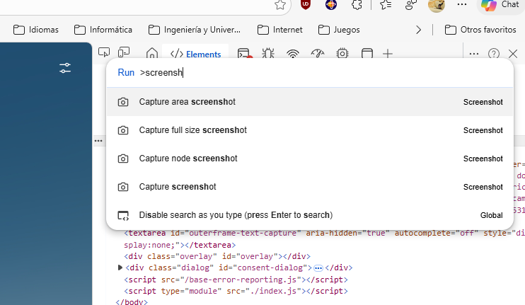

Ten en cuenta que la captura refleja el viewport activo en ese momento, es decir, el área visible del navegador descontando el espacio que ocupan las DevTools. Para capturar la página completa, amplía la ventana del navegador, o incluso mueve el panel de DevTools antes de lanzar la captura.

---

## Rúbrica de Evaluación

A continuación, encontrarás la rúbrica de evaluación. Aunque se han propuesto varios ejercicios a lo largo del documento, solo se evaluarán los tres ejercicios que se detallan a continuación.

| Ejercicio | Criterio | Descripción | Puntos |
| --------- | -------- | ----------- | ------ |
| **Ejercicio 1:** Instalación de WordPress, creación de una entrada e instalación del plugin Yoast SEO | Creación de una entrada en WordPress | La entrada incluye título (h1), subtítulos (h2), párrafos, imagen, vídeo, enlaces, listas y código HTML personalizado. | 2 |
| | Optimización SEO con Yoast | Se ha optimizado la entrada utilizando Yoast SEO y se ha obtenido el indicador verde. | 1 |
| **Ejercicio 2:** Modificación de la página inicial (Landing Page) | Estructura, contenido y diseño | La página inicial contiene un Call to Action, una descripción clara del servicio o producto, otros contenedores destacados y está visualmente organizada de forma clara y atractiva. | 3 |
| **Ejercicio 5:** Creación de una tienda online con WooCommerce | Instalación, configuración y creación de productos | Se ha instalado y configurado correctamente WooCommerce, y se han creado al menos dos productos con nombre, descripción, precio, SKU, stock y una imagen destacada. | 2 |
| | Importación de productos desde CSV | Se han importado productos desde un archivo CSV correctamente. | 1 |
| **Entrega general** | Entrega correcta | Se han entregado capturas de pantalla completas correctamente realizadas de todos los ejercicios evaluables con los formatos y los nombres pedidos o un vídeo explicativo mostrando las pantallas y explicándolas de no más de 1 minuto (solo se entregará 1 vídeo): `ejercicio1Tunombreyapellidos.png`, `ejercicio2Tunombreyapellidos.png` y `ejercicio5Tunombreyapellidos.png` o `video.mp4` | 1 |
| **TOTAL** | | | **10** |

---

## Ejercicio 1: Instalación de WordPress, creación de una entrada e instalación del plugin YOAST SEO

### 1.1. Instalación de WordPress en local

Instala WordPress en local mediante el método que consideres:

1. [Instalar WordPress con XAMPP](https://www.eniun.com/descargar-instalar-wordpress-local/)
2. [Instalar WordPress con Docker](https://www.eniun.com/instalar-wordpress-docker-compose/)

Si te decides por la instalación en cloud, también me sirve, pero deberás mostrarme que lo has instalado desde cero sobre una máquina virtual (AWS EC2, Azure Compute, ...) y **NO** con un servicio de hosting que ya tenga WordPress preinstalado.

### 1.2. Creación de una entrada en WordPress

Crea una nueva entrada relacionada con tu temática. Puedes sacar el texto a integrar mediante la herramienta que quieras, por ejemplo, con inteligencia artificial.

1. Accede al panel de administración de WordPress y selecciona "Entradas" > "Añadir nueva".
2. Crea una entrada con un título (h1) que refleje la temática elegida para tu sitio.
3. Incluye al menos una imagen relacionada con la temática de la entrada.
4. Utiliza subtítulos (h2) para organizar el contenido de la entrada en secciones.
5. Escribe varios párrafos que describan y desarrollen el tema de la entrada.
6. Agrega un vídeo incrustado que complemente el contenido de la entrada.
7. Incluye enlaces a recursos relevantes relacionados con la temática.
8. Utiliza viñetas o listas numeradas para presentar información de manera estructurada.
9. Utiliza la opción "editar HTML" e incluye el siguiente código personalizado modificando el texto a tu gusto:

```html
<div>
  <p>💡 <strong>Consejo rápido:</strong> Usa la etiqueta
  <abbr title="HyperText Markup Language">HTML</abbr> para estructurar
  tu contenido de manera clara.</p>
</div>
```

Ejemplo creación de entrada

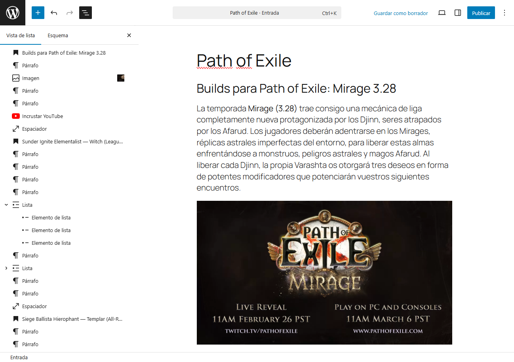

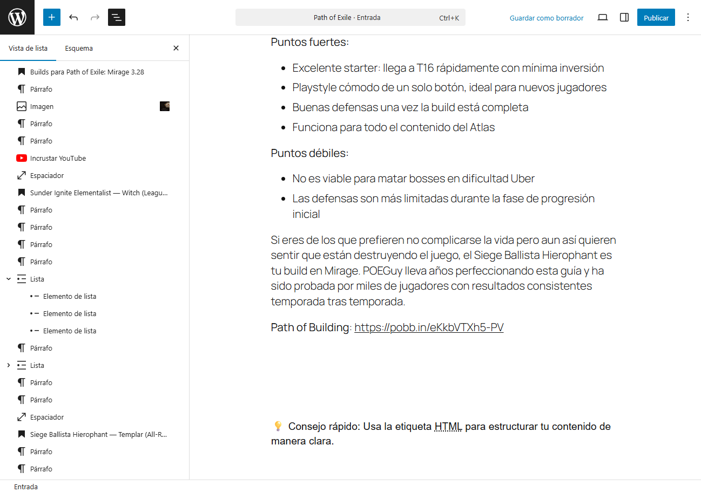

### 1.3. Instalación y uso del plugin Yoast SEO

Instala y activa el plugin Yoast SEO desde la sección de Plugins en el Panel de Administración. Accede a la entrada creada en el punto anterior y en la pantalla de edición de la entrada, utiliza Yoast SEO para mejorar la optimización SEO. Utiliza la funcionalidad de análisis de contenido para mejorar la legibilidad y SEO de tu entrada y conseguir el punto verde.


Lo normal es que al principio el análisis de Yoast SEO muestre varios puntos rojos o naranjas, lo importante es que vayas mejorando el contenido y la optimización hasta conseguir el punto verde.
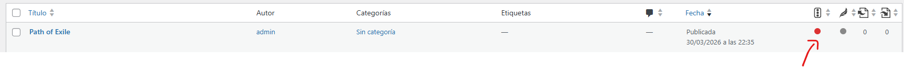

Paciencia en esta parte, tirar de inteligencia artificial para maneras para arreglar los puntos rojos o naranjas y conseguir el punto verde.

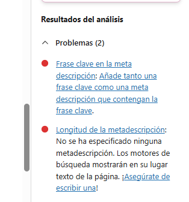

No es preciso resolver todos los puntos rojos o naranjas, con resolver los más importantes y conseguir el punto verde es suficiente para el ejercicio. En cualquier caso, si quieres mejorar más la optimización, puedes seguir mejorando el contenido y la optimización hasta conseguir el punto verde en todos los aspectos. Lo importante es que en la vista de entradas se vea el punto verde de Yoast SEO, lo que indica que la entrada está optimizada para SEO.

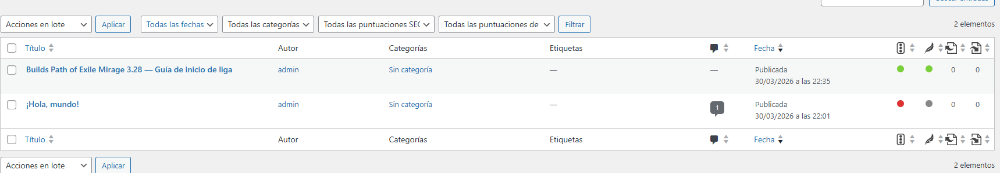

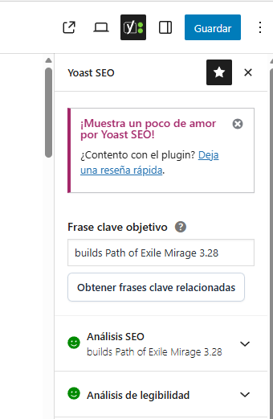

### 1.4. Entrega del ejercicio 1

> **Captura de página completa en vista previa llamada `ejercicio1Tunombreyapellidos.png` o un vídeo explicativo**

Haz una captura de pantalla **completa** (de todo el sitio web, bien con la herramienta de captura de pantalla del navegador o con una extensión) en vista previa de la entrada creada, asegurándose de que se vea:

- Título (h1), subtítulos (h2), párrafos, imagen, vídeo, enlaces y listas.
- Código HTML personalizado con `<abbr>`.
- Sección de Yoast SEO con la optimización realizada y el indicador en verde. Despliega el Yoast SEO para que se vea la optimización.

---

## Ejercicio 2: Modificación de la página inicial (Landing Page)

**Diseña una página inicial atractiva para tu sitio web.** Puedes incluir los siguientes elementos (no es obligatorio incluirlos todos):

- **Call to Action (CTA):** un bloque que invite al visitante a realizar una acción concreta ("Registrarse", "Comprar ahora", "Suscribirse"…), acompañado de un botón bien visible.
- **Descripción del servicio o producto:** presenta claramente qué ofrece tu sitio, combinando texto e imágenes para captar la atención y comunicar el valor de tu propuesta.
- **Otros contenedores de interés:** características adicionales, testimonios de clientes, beneficios exclusivos, etc.

Si quieres, puedes inspirarte en la web de la consultora que realizaste en el proyecto intermodular de LMSGI — aunque si tienes otra idea, adelante con ella.

Importante es una **página** no una **entrada**. Para ello, puedes crear una página nueva y configurarla como página de inicio en los ajustes de lectura de WordPress.

Además, añade los siguientes elementos de CSS y JavaScript de forma correcta en WordPress, **sin insertar código dentro del contenido de la página**:

**Texto justificado (CSS) — vía CSS adicional:**

Ve a **Apariencia > Personalizar (en el tema activo) > Estilos > Los 3 puntitos > CSS adicional** y añade el siguiente código CSS:

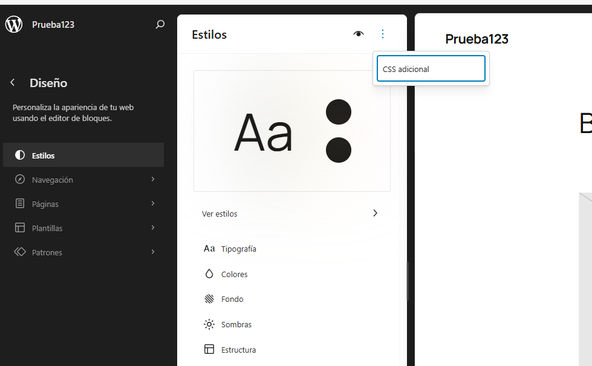

```css
.wp-block-paragraph {
  text-align: justify;
}
```

Aplicando la clase CSS recién creada, haz que el texto de los párrafos de tu página inicial se justifique correctamente. Con excepción del que tenga sentido tener centrado, como el texto del Call to Action.

> [!TIP]
> Puedes crear grupos de bloques para organizar mejor el contenido y aplicar la clase CSS a todo el grupo, de esta forma se aplicará a todos los bloques de párrafo que estén dentro del grupo.

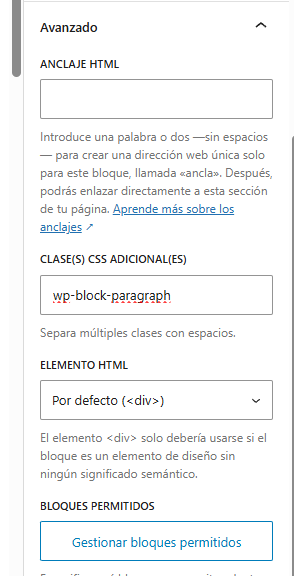

Fíjate en la diferencia entre el primer y el segundo párrafo.

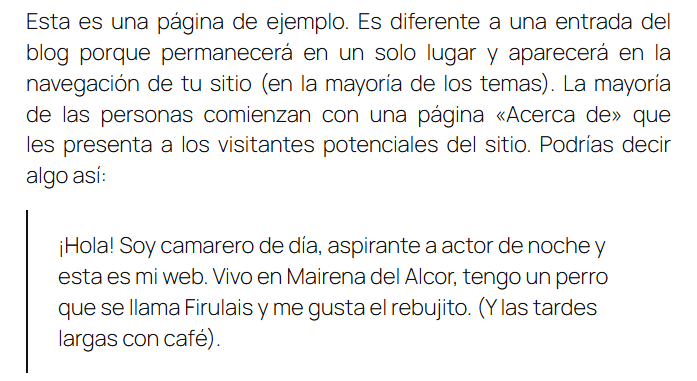

**Efecto de revelado al hacer scroll — vía WPCode:**

Instala el plugin **WPCode - Insert Headers and Footers...**. Este plugin permite añadir código CSS y JavaScript a tu sitio sin editar archivos del tema. Fíjate que una vez instalado se llamará **WPCode Lite** en su versión gratuita.

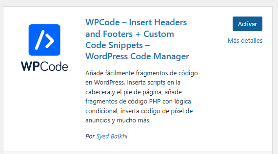

**Paso 1 — Añade la clase CSS al bloque**

En el panel lateral del bloque → "Clase CSS adicional" → escribe `reveal`

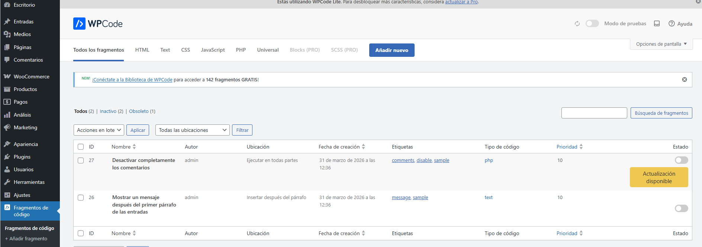

**Paso 2 — Crea un snippet CSS**

Ve a **Code Snippets → Add Snippet → Custom CSS** y añade:

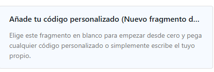

```css
.reveal {
  opacity: 0;
  transform: translateY(30px);
  transition: opacity 0.6s ease, transform 0.6s ease;
}
.reveal.visible {
  opacity: 1;
  transform: none;
}
```

**Paso 3 — Crea un snippet JavaScript**

Ve a **Code Snippets → Add Snippet → Custom JavaScript** y añade:

```js
document.addEventListener('DOMContentLoaded', function () {
  const observer = new IntersectionObserver(function (entries) {
    entries.forEach(function (entry) {
      if (entry.isIntersecting) {
        entry.target.classList.add('visible');
      }
    });
  });
  document.querySelectorAll('.reveal').forEach(function (el) {
    observer.observe(el);
  });
});
```

> [!NOTE]
> El efecto de revelado requiere de ambas partes, el CSS para definir la animación y el JavaScript para añadir la clase que activa la animación cuando el elemento entra en el viewport al hacer scroll.

Asegúrate de activar ambos snippets para que el efecto funcione correctamente. El resultado será que los elementos con la clase `reveal` se mostrarán con un efecto de desvanecimiento y desplazamiento al hacer scroll, así que ¡no te olvides de añadir la clase `reveal` a los bloques que quieras que tengan este efecto!

Otra **cuestión importante** es que si quieres que el efecto del revelado sea al hacer scroll no podemos usar el truco de darle la clase `reveal` al contenedor padre, ya que sino el efecto se aplicará al contenedor padre y no a los bloques individuales, por lo que el efecto de revelado no se verá al hacer scroll, sino que se verá todo el contenido de golpe cuando el contenedor padre entre en el viewport. Por eso es importante añadir la clase `reveal` a cada bloque individual que queramos que tenga el efecto de revelado. Bastante tedioso pero el efecto es muy chulo, así que merece la pena el esfuerzo.

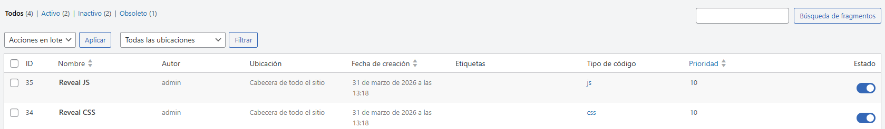

Ejemplo


### 2.1. Entrega del ejercicio 2

> **Captura de página completa llamada `ejercicio2Tunombreyapellidos.png` + vídeo breve explicativo para el reveal**

---

## Ejercicio 3: Ajustes generales, lectura, escritura, comentarios, enlaces permanentes y usuarios (NO EVALUABLE)

Realiza los siguientes ajustes:

1. En ajustes generales:
   - Modifica el título y la descripción del sitio.
   - Indica el formato de fecha y hora preferidos.
2. En escritura:
   - Selecciona una categoría por defecto creada por ti para las entradas.
3. Lectura:
   - Para cada entrada en el feed, incluir: extracto.
   - Indica 20 entradas a mostrar en el feed xml.
   - No permitas que se indexe la web.
4. Configuración de comentarios:
   - Elige la opción de requerir aprobación previa para los comentarios antes de ser publicados en tu sitio. (Comentario debe aprobarse manualmente)
5. Enlaces permanentes:
   - Configura la estructura de enlaces permanentes como "Nombre de la entrada".
   - Cambia el texto base para categorías y etiquetas.
6. Usuarios:
   - Añade un nuevo usuario de tipo "Autor".

---

## Ejercicio 4: Creación de un formulario con WPForms (NO EVALUABLE)

Practica la creación de un formulario de contacto utilizando el plugin **WPForms Lite** en WordPress, e intégralo en una página específica y en el menú de navegación del sitio web.

> **Nota sobre plugins de formularios:** El ecosistema ha evolucionado mucho. Contact Form 7 fue durante años el estándar, pero actualmente ha sido superado por alternativas más modernas. WPForms Lite (+6M instalaciones activas) es hoy la opción más recomendada para principiantes por su interfaz visual de arrastrar y soltar. Si te interesa explorar una alternativa con más funcionalidad gratuita, prueba también **Fluent Forms Free**, que además guarda las entradas del formulario en la base de datos sin coste.

1. Crea un formulario de contacto:
   - Instala y activa el plugin **WPForms Lite** desde la sección de Plugins en el Panel de Administración de WordPress.
   - Ve a "WPForms" > "Añadir nuevo" y selecciona la plantilla "Simple Contact Form".
   - Utiliza el constructor visual para añadir o modificar campos: nombre, email, asunto, mensaje, teléfono, etc.
2. Personaliza el formulario:
   - Ajusta las etiquetas, los mensajes de error y los textos de ayuda de cada campo.
   - Configura el mensaje de confirmación que verá el usuario al enviar el formulario.
3. Integra el formulario en una página `/contacto`:
   - Crea una nueva página llamada "Contacto" desde "Páginas" > "Añadir Nueva".
   - Inserta el formulario con el bloque "WPForms" del editor de bloques, o mediante el shortcode que genera el plugin.
   - Guarda la página y verifica que el formulario se muestre correctamente en la URL "/contacto".
4. Añade la página al menú de navegación:
   - Ve a "Apariencia" > "Menús" en el Panel de Administración.
   - Agrega la página "Contacto" al menú principal o al menú de navegación deseado.
   - Guarda los cambios en el menú para que el enlace a la página de contacto aparezca en el sitio web.

---

## Ejercicio 5: Creación de una tienda online con WooCommerce

Aprende a configurar una tienda online utilizando WooCommerce en WordPress.

**Instalación de WooCommerce:**

- Sigue los pasos del [tutorial para instalar WooCommerce](https://www.eniun.com/tutorial-woocommerce/) en tu sitio web de WordPress.
- Activa el plugin una vez que se haya instalado correctamente.

**Configuración inicial de WooCommerce:**

- Completa la configuración inicial utilizando el asistente proporcionado por WooCommerce.
- Establece la ubicación de tu tienda, tipos de productos, opciones de pago y envío, etc.

**Creación de productos:**

- **Crea manualmente** al menos dos productos para tu tienda utilizando WooCommerce.
  - Para cada producto, agrega nombre, descripción, precio, SKU, stock y una imagen destacada.
  - Explora las opciones avanzadas como atributos, variaciones y descuentos si lo deseas.
- **Importa productos desde un archivo CSV o TXT**
  - Descarga los CSV de muestra que proporciona WooCommerce en su carpeta `sample-data`.
  - Sigue estos pasos para importar los productos:
    - En el panel de administración de WordPress, ve a **«Productos»**.
    - Haz clic en **«Importar»** (parte superior de la página).
    - Pulsa **«Elegir archivo»** y selecciona tu archivo CSV.

**Configuración de páginas WooCommerce:**

- Verifica que las páginas esenciales como "Carrito", "Finalizar compra" y "Mi cuenta" estén correctamente configuradas.
- Personaliza estas páginas si deseas añadir contenido adicional.

**Configuración de pagos y envíos:**

- Accede a la configuración de WooCommerce y establece los métodos de pago y envío que deseas ofrecer en tu tienda.
- Conecta tus cuentas de pago y configura las tarifas de envío según tus necesidades.

**Pruebas y gestión de la tienda:**

- Realiza pruebas de compra para verificar que los productos se añaden al carrito y se completan las transacciones correctamente.
- Accede a la sección de "Pedidos" en el panel de administración para gestionar tus pedidos, realizar seguimiento del inventario y ajustar configuraciones según sea necesario.

### 5.1. Entrega del ejercicio 5

> **Captura de página completa de la página en la que se muestren los productos creados llamada `ejercicio5Tunombreyapellidos.png`. Se deben visualizar los productos creados manualmente y los creados mediante importación del CSV. También puedes entregar un vídeo explicativo**.

Por favor asegúrate de tomar la captura de pantalla de la página completa, tál y cómo se explicó al principio de este documento.

Un ejemplo mínimo de captura de pantalla lo tienes en la siguiente imagen: [Página de tienda con productos WooCommerce](./img/woocomerce-ejemplo.png)

---

## Ejercicio 6: Personalización del tema de WordPress (NO EVALUABLE)

Temática del sitio: Debes elegir una temática para tu página, como ocio, deporte, educación, etc.

1. **Cambio de tema:** Selecciona un tema preinstalado o instala uno nuevo desde la sección de Temas en el Panel de Administración de WordPress. Por ejemplo, puedes instalar GeneratePress.
2. **Personalización del tema**: Utiliza el Personalizador de WordPress para ajustar aspectos como colores, fuentes, encabezados, fondos y más.
3. **Agregar y organizar widgets:** Arrastra y suelta los widgets disponibles en las áreas específicas de tu sitio web, como barras laterales o pies de página.
4. **Crear y personalizar menús de navegación:** Crea un nuevo menú y asigna elementos a ubicaciones específicas en tu tema, como el menú principal o el menú de pie de página.

---

## Ejercicio 7: Agregar un enlace al feed xml (NO EVALUABLE)

Agrega un enlace a tu feed xml en tu landing page. Investiga cómo implementarlo.

---

## Ejercicio 8: Investigación de plugins y funcionalidades (NO EVALUABLE)

Selecciona un tema y realiza una explicación de cómo se hace:

- Elección de un dominio, elección de hosting, instalación WordPress, certificado SSL.
- Realización de copias de seguridad de WordPress y trasladar una web a otro sitio.
- Modificar archivos php, css y html en WordPress desde el editor. Realización de una prueba en la que se editen esos archivos y se muestre el resultado. Cómo hacer tu propio plugin de WordPress.
- Plugins interesantes para WordPress y formas de monetizar un sitio web.
