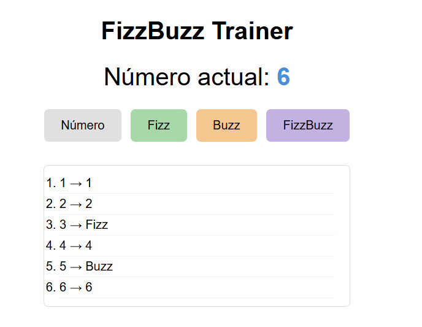

# Ejercicio DOM — FizzBuzz Trainer (JavaScript + DOM)

### Instrucciones

Abre el fichero [index.html](index.html) en el navegador y [starting.js](starting.js) en tu editor.

- Abre la consola del navegador (F12) para ver posibles errores
- No cambies el HTML
- Al terminar, comprueba que al pulsar los botones se va construyendo el historial

---

### Lo que debes implementar

La página muestra el número actual (empieza en 1) y cuatro botones: **Número**, **Fizz**, **Buzz** y **FizzBuzz**.

Cada vez que el usuario pulsa un botón ocurren tres cosas:

1. Se añade un `<li>` al historial con el formato `"X → Opción"`, donde:
   - `X` es el número actual
   - `Opción` depende del botón pulsado:
     - **Número** → se escribe el propio número (ej: `"4 → 4"`)
     - **Fizz** → se escribe `Fizz` (ej: `"3 → Fizz"`)
     - **Buzz** → se escribe `Buzz` (ej: `"5 → Buzz"`)
     - **FizzBuzz** → se escribe `FizzBuzz` (ej: `"15 → FizzBuzz"`)
2. El número actual se incrementa en 1 (siempre, independientemente del botón pulsado)
3. El número mostrado en pantalla se actualiza

El juego no comprueba si la respuesta es correcta — eres tú quien debe conocer las reglas del FizzBuzz y pulsar el botón adecuado.

**Recordatorio FizzBuzz:**
- Múltiplos de 3 → Fizz
- Múltiplos de 5 → Buzz
- Múltiplos de 15 (múltiplos de 3 y de 5 a la vez) → FizzBuzz
- El resto → Número

**Pistas:**
- Selecciona elementos con `document.querySelector('#id')`
- Añade eventos con `addEventListener('click', function() { ... })`. O con lambdas `addEventListener('click', () => { ... })`
- Crea un elemento nuevo con `document.createElement('li')`
- Asigna texto con `.textContent = 'texto'`
- Añádelo a la lista con `historial.appendChild(li)`